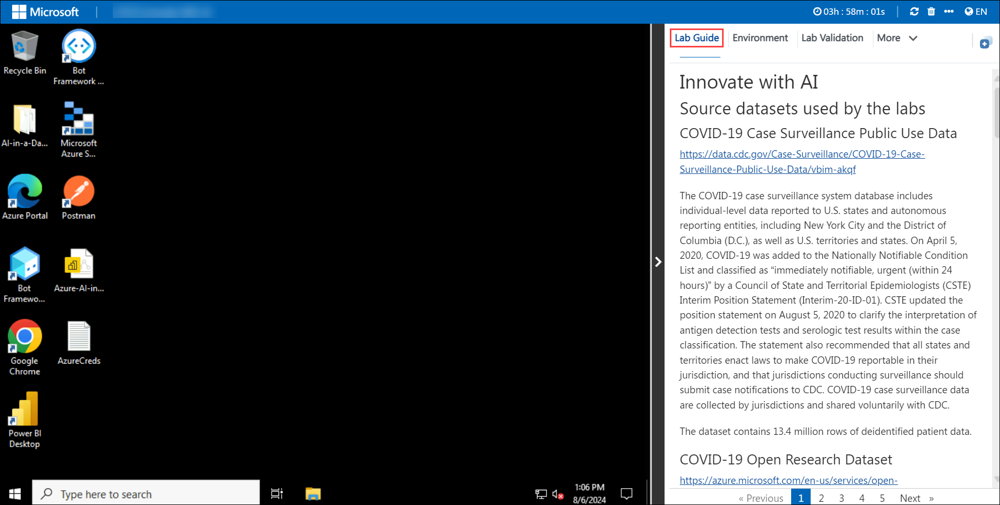
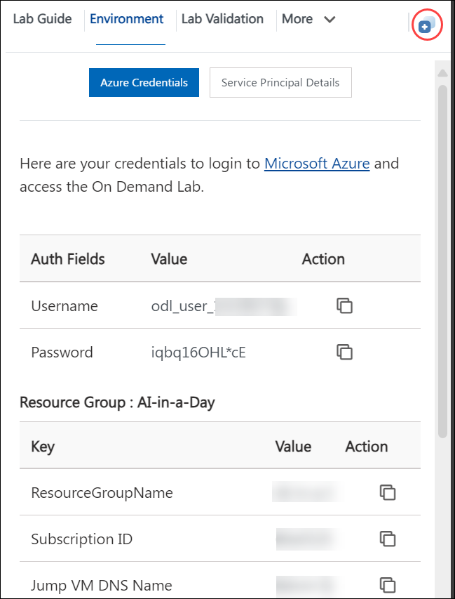

# Innovate with AI

## Overall Estimated Duration: 8 Hours

## Overview

In this lab, you will explore the use of Natural Language Processing and Machine Learning to classify COVID-19 research papers into natural groupings. You will utilize Automated Machine Learning (AutoML) in Azure to train and refine the best classification models. The lab emphasizes the importance of a fully automated and traceable process for managing large volumes of incoming research documents, ensuring data quality through engineering processes, and providing advanced indexing and search capabilities using Cognitive Search. Additionally, you will learn how to leverage Conversational AI, using Power Virtual Agents and Azure AI Services, to help analysts easily navigate and find relevant research documents through natural language interactions.

## Objective

Understand how to utilize Natural Language Processing, Machine Learning, and Conversational AI in Azure for classifying and exploring COVID-19 research papers. By the end of the lab, you will have knowledge on : 

- **Azure Machine Learning Model Training** : Learn to build, train, and evaluate machine learning models using Azure Machine Learning. You will explore the end-to-end process, from data preparation to model deployment, leveraging Azure's Automated ML and other tools for streamlined development and operationalization.
- **Document Processing and Summarization with Azure Document Intelligence and AI Service for Language** : Explore document processing and summarization using Azure Document Intelligence and AI Service for Language. learn to extract, analyze, and summarize key information from documents, enhancing data accessibility and comprehension.
- **Knowledge Mining with Azure AI Search** : Learn to create rich search experiences by indexing and exploring data, extracting insights, and enabling advanced search capabilities across structured and unstructured content.
- **Conversational AI with Bot Service using Power Virtual Agents** : Learn to create new topics, define conversation flows, and test the bot, enabling interactive and natural language interactions with users.

## Pre-requisites

- Basic understanding of Azure AI Services and Azure DevOps
- working knowledge with Github
- Familarity with Machine Learning concepts

## Architecture

In this lab, you will use AI technologies to manage and analyze COVID-19 research papers. You'll apply Natural Language Processing and Machine Learning with Azure Automated ML to classify and group papers effectively. The workflow involves transforming natural language data for machine learning, ensuring high data quality, and using Azure AI Search for advanced document indexing and exploration. Additionally, you'll implement a conversational AI solution with Power Virtual Agents and Azure AI Services to enable intuitive navigation and retrieval of relevant research.

## Architecture Diagram

## Explanation of Components

- **Natural Language Processing (NLP)** : Utilizes NLP techniques to analyze and understand the text within research papers, enabling the extraction of meaningful information and patterns.

- **Machine Learning with Automated ML** : Employs Azure Automated ML to build, train, and refine classification models that automatically categorize and group research papers based on their content.

- **Azure AI Search** : Provides advanced indexing and search capabilities, allowing users to perform complex queries and explore semantic relationships within the research document corpus.

- **Data Engineering and Quality Assurance** : Involves transforming natural language data into numerical formats suitable for machine learning and ensuring data accuracy and completeness through robust quality checks.

- **Conversational AI with Power Virtual Agents** : Implements a chatbot interface using Power Virtual Agents and Cognitive Services to facilitate intuitive, natural language interactions for navigating and retrieving relevant research documents.

## Getting Started with Lab
Once you're ready to dive in, your virtual machine and lab guide will be right at your fingertips within your web browser.

## Virtual Machine & Lab Guide
Your virtual machine is your workhorse throughout the workshop. The lab guide is your roadmap to success.

## Exploring Your Lab Resources
To get a better understanding of your lab resources and credentials, navigate to the **Environment Details** tab.

## Utilizing the Split Window Feature
For convenience, you can open the lab guide in a separate window by selecting the Split Window button from the top right corner.

## Managing Your Virtual Machine
Feel free to start, stop, or restart your virtual machine as needed from the Resources tab. Your experience is in your hands!

Click **Next** from the bottom right corner to embark on your Lab journey!

Now you're all set to explore the powerful world of technology. Feel free to reach out if you have any questions along the way. Enjoy your workshop!

## Support Contact
The CloudLabs support team is available 24/7, 365 days a year, via email and live chat to ensure seamless assistance at any time. We offer dedicated support channels tailored specifically for both learners and instructors, ensuring that all your needs are promptly and efficiently addressed.

Learner Support Contacts:

- Email Support: labs-support@spektrasystems.com
- Live Chat Support: https://cloudlabs.ai/labs-support

## Happy Learning!!

