# Lab 1 - Azure Machine Learning Model Training

This lab covers clustering with Azure Machine Learning, Automated ML, and model explainability.

## Task 1 - Explore dashboard of COVID-19 data

Understanding the source datasets is very important in AI and ML. To help you expedite the process, we have created a Power BI dashboard you can use to explore them at the beginning of each lab.


To get more details about the source datasets, check out the [Data Overview](https://github.com/CloudLabsAI-Azure/ai-in-a-day/blob/main/data-overview.md) section.

To explore the dashboard of COVID-19 data, open the `Azure-AI-in-a-Day-Data-Overview` file located on the desktop (**C:\Users\public\desktop**) 💻 of the virtual machine provided with your environment. If you see `Introducing the updated mobile layout` pop-up screen, then close it by clicking on `Got it`. Collapse the **Fields** and **Visualizations** tabs to see the clear report.

> **Note:** Please close and reopen the Power BI Desktop document if it throws an error in the first attempt.

 

## Task 2 - Explore lab scenario

Given the magnitude of the COVID-19 problem, it comes naturally to have a lot of research on the topic. In fact, in 2020 alone, tens of thousands of papers have been published on COVID-19 alone. The sheer amount of communication on the subject makes it difficult for a researcher to grasp and structure all the relevant topics and details. Furthermore, pre-defined catalogs and paper classification might not always reflect their content in the most effective way possible.

Based on a set of existing research papers, we will use Natural Language Processing and Machine Learning to identify these papers' natural grouping. For each new document that gets into our system, we will use Machine Learning to classify it into one of the previously identified groups. We will use Automated ML (a feature of Azure Machine Learning) to train the best classification model and explain its behavior.

The following diagram highlights the portion of the general architecture covered by this lab.


The high-level steps covered in the lab are:

- Explore dashboard of COVID-19 data
- Explore lab scenario
- Run word embedding process on natural language content of research papers
- Explore results of word embedding
- Run clustering of research papers and explore results
- Use the newly found clusters to label the research document and run the Auto ML process to train a classifier
- Run the classifier on "new" research papers
- Explain the best model produced by AutoML

## Task 3 - Prepare Azure Machine Learning workspace

1. In the **LabVM**, click on the **Azure Portal** shortcut of the Microsoft Edge browser, which is created on the desktop 💻.
  
    
    
1. On the **Sign into Microsoft Azure** tab, you will see the login screen. In that enter the following **Email/Username** and then click on **Next**. 
   
   * Email/Username: <inject key="AzureAdUserEmail"></inject>
   
1. Enter the following **Password** and click on **Sign in**. 
   
   * Password: <inject key="AzureAdUserPassword"></inject>
   
1. If you see the pop-up **Stay Signed in?**, click **No**. Also, if you see a **Save Password** pop-up, close that.

1. If you see the pop-up **You have free Azure Advisor recommendations!**, close the window to continue the lab.

1. If the **Welcome to Microsoft Azure** pop-up window appears, click **Maybe Later** to skip the tour.

1. Navigate to `All Resources`.

    
        
1. Locate **Machine Learning** resource **ai-in-a-day-<inject key="DeploymentID" enableCopy="false"/>**, select that.

    
    
1. Click on **Launch studio**. If you are prompted to sign in again, use the same lab credentials you used to login to the Azure portal. Close the welcome **pop-up** if any with the cross icon.  
    
    

1. In Azure Machine Learning Studio, select `Compute` **(1)** from the left side menu and verify that your compute instance is `running` **(2)**.
   * Compute instance name: notebook<inject key="DeploymentID" enableCopy="false"/>

    

    >**Note**: If you launched Azure Machine Learning Studio right after your lab environment was provisioned, you might find the compute instance in a provisioning state. In this case, wait a few minutes until it changes its status to `Running`.

1. In the Azure Machine Learning Studio under **Compute** **(1)**, open the **Terminal** **(2)** environment.
    
   
   
1. Run the following commands and make sure all commands will execute successfully.
    ```  
    conda env create -f aiw-ai-kernel.yml
    conda activate aiw-ai-kernel
    ipython kernel install --user --name aiw-ai-kernel --display-name "Python (aiw-ai-kernel)"
    ```
   
   
   

1. From the `Application` section associated with the compute instance, select `Jupyter` **(1)**. 

    

1. If you see **IMPORTANT NOTE: Always use trusted code**, then check on **Yes, I Understand** and then click **Continue**.

    
    
## Task 4 - Prepare data for the Machine Learning process

1. In the Jupyter application, navigate to the given path **\Users\odl_user_<inject key="DeploymentID" enableCopy="false"/>** and open `1. Data Preparation.ipynb` notebook.

   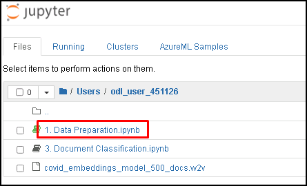
   
2. On Jupiter page, select **Kernel** *(1)*, then **Change kernel** *(2)* and make sure **Python (aiw-ai-kernel)** *(3)* is selected.

   

3. Execute the cells inside `1. Data Preparation.ipynb` notebook one by one (Click on the 'Run' button or by using either Ctrl + Enter to stay on the same cell, or Shift + Enter to advance to the next cell or ) and observe the results of each cell execution.

   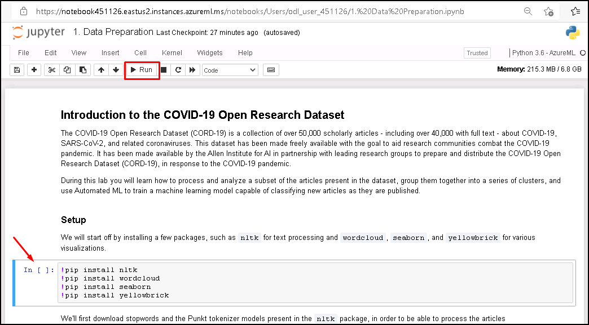
   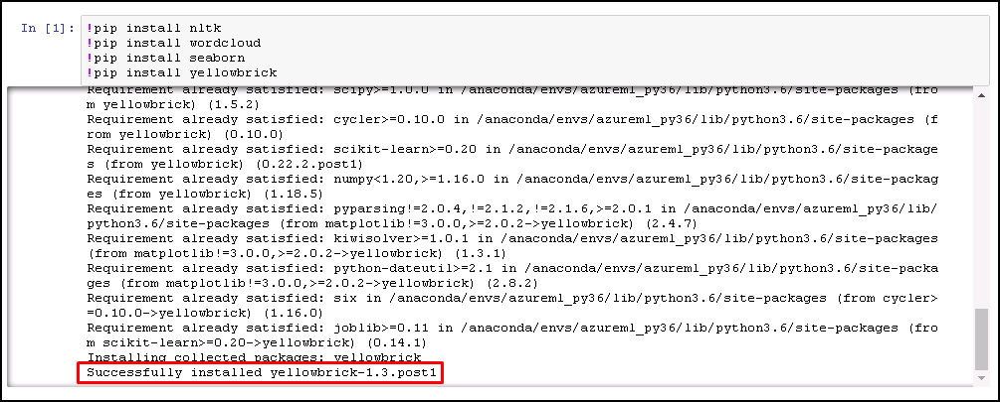

## Task 5 - Train a Machine Learning model with Automated ML

In this task, we'll use Azure Automated ML to train a machine learning model capable of determining the best cluster for a COVID-19 scientific article. It builds upon the work done in the Data Preparation notebook.

1. In the Azure Machine Learning Studio, switch to the `Automated ML` **(1)** section and select `+ New Automated ML job` **(2)** to start the Automated ML.

    

2. In the `Create a new Automated ML job` wizard pick `COVID19Articles_Train_Vectors` **(1)** as your dataset and select `Next` **(2)** to proceed.

    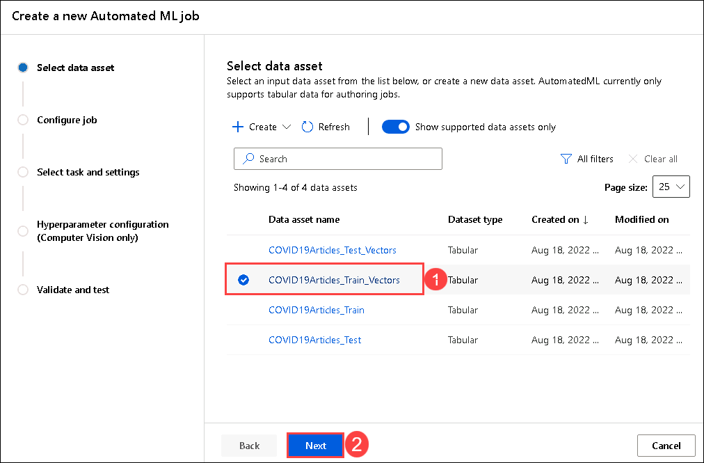

3. In order to be able to launch an Automated ML run we need to provision an Azure ML compute cluster. On the `Configure run` step select `aml-compute-cpu` **(1)** from the list of clusters. If the list is empty select `+ New` **(2)** link.

    

    > **Note:** If you already have `aml-compute-cpu` cluster provisioned, feel free to skip to step 6.

4. On the `Create compute cluster` screen set the values listed below:

    - **Virtual machine priority (1)**: Dedicated
    - **Virtual machine type (2)**: CPU
    - **Virtual machine Size (3)**: Standard_DS3_v2

    

    Select `Next` **(4)** to continue.

5. To configure cluster settings set the values given below:

    - **Compute name (1)**: aml-<inject key="DeploymentID" enableCopy="false"/>
    - **Minimum number od nodes (2)**: 0
    - **Maximum number of nodes (3)**: 4  

    Setting the number of maximum nodes to a higher value will allow Automated ML to run more experiments in parallel but will also increase your costs.

    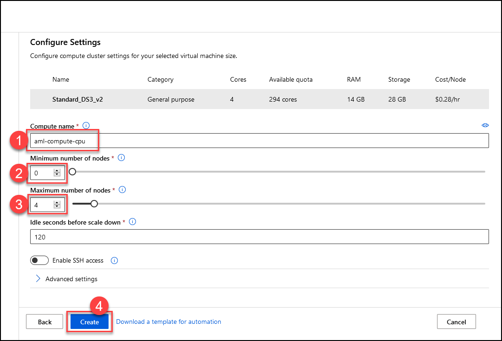

    Select `Create` **(4)** to proceed.

6. Set the experiment name to `COVID19_Classification` **(1)** and Target column to `cluster` **(2)**. The values we're trying to predict are in the `cluster` column. Then for compute type, select `Compute cluster` **(3)**. If your Azure ML compute cluster is not yet selected, make sure `aml-compute-cpu` **(4)** is selected as your compute for the experiment. Select `Next` **(5)** to continue.

    

7. On the `Select task and settings` screen, make sure `Classification` **(1)** is selected (confirm with green check). If it is not selected, then select `View additional configuration settings` **(2)** to open a new panel of settings.

    

8. On the `Additional configurations` panel, fill in the values listed below:

    - **Primary metric (1)**: AUC weighted
    - Explore **Exit criterion (2)**
    - **Training job time (hours) (3)**: 0.5
    - **Metric score threshold (4)**: 0.95
    - Explore **Concurrency (5)**
    - **Max concurrent iterations (6)**: 4
  
    

    Thanks to the 0.5 hours set for `training job time`, the experiment will stop after 30 minutes to minimize cost. When it comes to `Max concurrent iterations`, Automated ML can try at most four models at the same time, this is also limited by the compute instance's maximum number of nodes.

    Select `Save` **(7)**.
    
9. Now, click on the **Next (1)** button to move on [optional] Validate and test.
 
   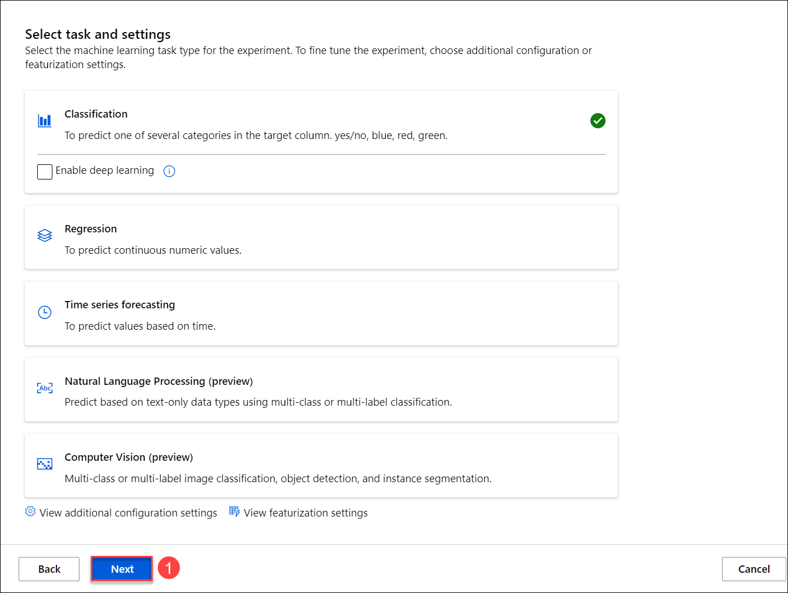

10. On the `Select the validation and test type`, fill in the values listed below:

    - **Validation type (1)**: k-fold cross validation
    - **Number of cross validations (2)**: 5
    - Leave Default for Test dataset (preview)

    Select `Finish` **(3)** to kick off the Automated ML experiment run. If this is the first time you are launching an experiment run in the Azure Machine Learning workspace, the total experiment time will be longer than the `training job time` we have set. This is because of the time needed to start the Compute Cluster and deploy the container images required to execute.

    

11. On the following screen, you will see the progress of your experiment run.

12. Now that you understand the process of launching an AutoML run, let's explore in the next task the results of an already completed AutoML run.

>**Note**: We have already executed in this environment an AutoML run that is very similar to the one you've just launched. This allows you to explore AutoML results without having to wait for the completion of the run.

## Task 6 - Explore AutoML results

1. In the Azure Machine Learning Studio, navigate to the **Jobs (1)** section and locate the **COVID19_Classification** experiment **(2)**. Select the experiment name link.

   

2. You will navigate to the experiment details page, where you should see the list of experiment runs. Locate the first run **(1)** listed here, which has the status **Completed**. The name of the run can be different in your environment and may not match the below screenshot.

   

3. On the **Run details** page, navigate to the **Models (1)** section. Check the values on the  **AUC weighted** column **(2)**, which is the primary metric selected in the AutoML run configuration. See how the best model was selected; this is the one with the maximum metric value. This is also the model for which the explanation was generated. Select **View explanation (3)**.

   

4. On the **Explanations (preview) (1)** section, browse the available explanations **(2)** and investigate the **Model performance (3)** representation.

   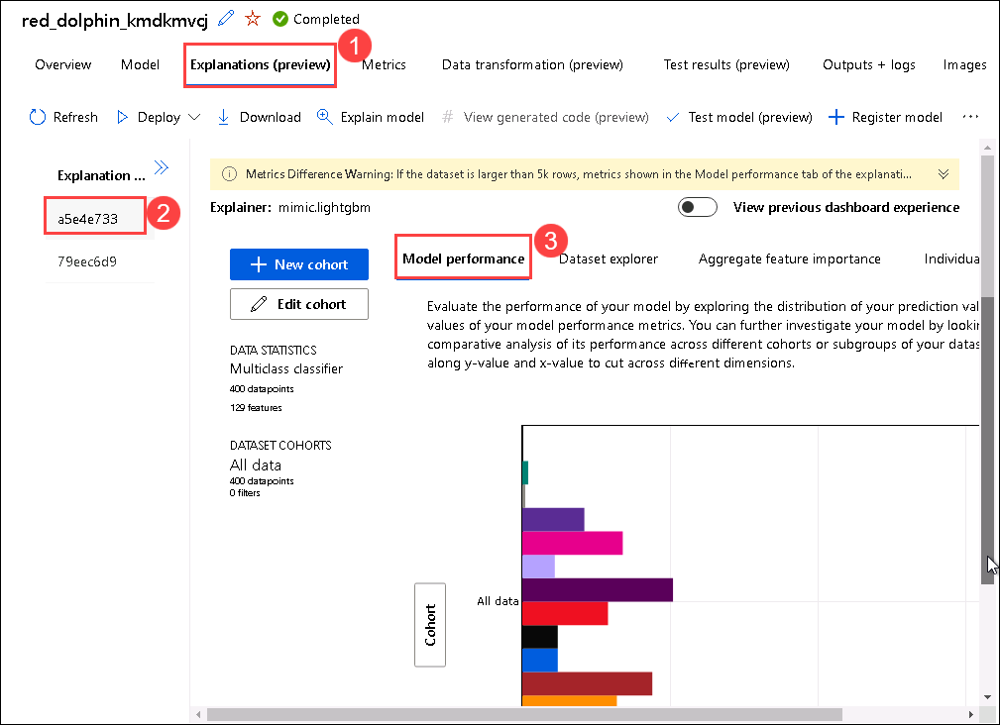

## Task 7 - Generate a Responsible AI dashboard in the studio UI

1. In the Azure Machine Learning Studio, navigate to the registered model you’d like to create Responsible AI insights **Models (1)** section under Assets and locate the **rai_diabetes_decision_model_xxxx (2)**. Select the model available.

   

2. In **rai_diabetes_decision_model** page, from the **Responsible AI** option click the **Create dashboard** button.

   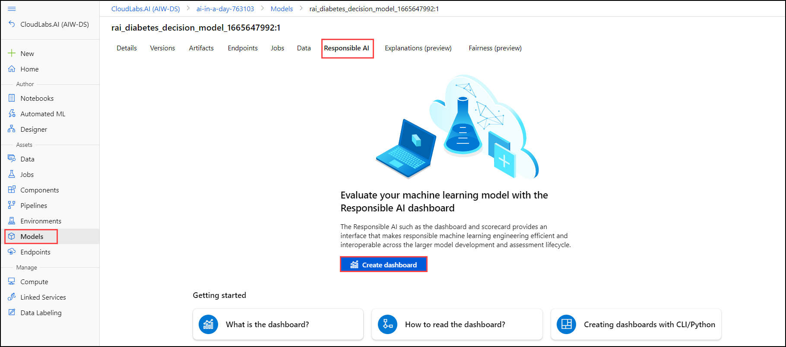

   The wizard is designed to provide an interface to input all the necessary parameters to instantiate your Responsible AI dashboard without having to touch code. The  experience takes place entirely in the Azure Machine Learning studio UI with a guided flow and instructional text to help contextualize the variety of choices in  which Responsible AI components you’d like to populate your dashboard. The wizard is divided into five steps:

    - Datasets
    - Modeling task
    - Dashboard components
    - Component parameters
    - Experiment configuration

3. Under the **Datasets for training and testing** page, we need to select the train and test dataset that you used when training your model to generate model-debugging insights. Select the datasets as per the below instruction and click on **Next**.

   - **Select a dataset for training** : From the dropdown select **COVID19Articles_Train**
   - **Select a dataset for testing**  : From the dropdown select  **COVID19Articles_Test**

   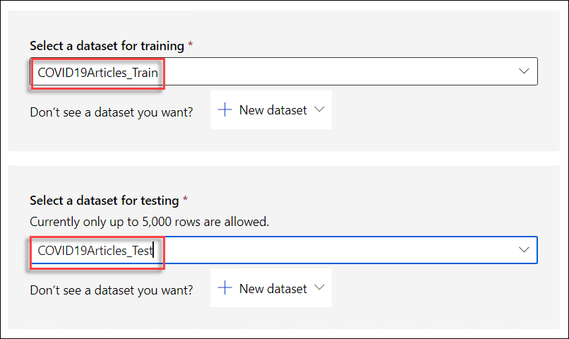

4. Once we picked the dataset, select the **Regression** modeling type and click **Next**

   

5. Now we need to select the Dashboard components; the Responsible AI dashboard offers two profiles for recommended sets of tools you can generate:

   - **Model debugging**: Understand and debug erroneous data cohorts in your ML model using Error analysis, Counterfactual what-if examples, and Model explainability
   - **Real life interventions** : Understand and debug erroneous data cohorts in your ML model using Causal analysis

6. Select the **Model Debugging** component and click **Next**

   
   
7. After selecting a profile, we need to configure parameters for dashboard components. Explore through the component parameters for model debugging
  
   - **Target feature (required)**: Specify the feature that your model was trained to predict
   - **Categorical features**: Indicate which features are categorical to properly render them as categorical values in the dashboard UI. This is pre-loaded for you based on your dataset metadata.
   - **Generate error tree and heat map**: Toggle on and off to generate an error analysis component for your Responsible AI dashboard
   - **Features for error heat map**: Select up to two features to pre-generate an error heatmap.
   - **Advanced configuration**: Specify additional parameters for your error tree, such as Maximum depth, Number of leaves, and Minimum number of samples in one leaf.
   - **Generate counterfactual what-if examples**: Toggle on and off to generate counterfactual what-if components for your Responsible AI dashboard
   - **Number of counterfactuals** (required): Specify the number of counterfactual examples you want to generated per datapoint. A minimum of at least 10 should be generated to enable a bar chart view in the dashboard of which features were most perturbed on average to achieve the desired prediction.
   - **Range of value predictions (required)**: Specify for regression scenarios the desired range in which you want counterfactual examples to have prediction values. For binary classification scenarios, it will automatically be set to generate counterfactuals for the opposite class of each datapoint. For multi-classification scenarios, there will be a drop-down to specify which class you want each datapoint to be predicted as.
   - **Specify features to perturb**: By default, all features will be perturbed. However, if there are specific features you want perturbed, clicking this will open a panel with the list of features to select. (See below)
   - **Generate explanations**: Toggle on and off to generate a model explanation component for your Responsible AI dashboard. No configuration is necessary as a default opaque box mimic explainer will be used to generate feature importance.
  
8. In **Target feature** select **Column1** and for **Categorial features** select **0 to 6 Decimal** from the dropdown. **Disable** the **Error tree and heat map** option. If enabling the **Counterfactual what-if examples** please ensure to provide _Number of counterfactuals_ and _Range of value predictions_ as shown in the below screenshot. Leave the other parameters to default and select **Next**.

   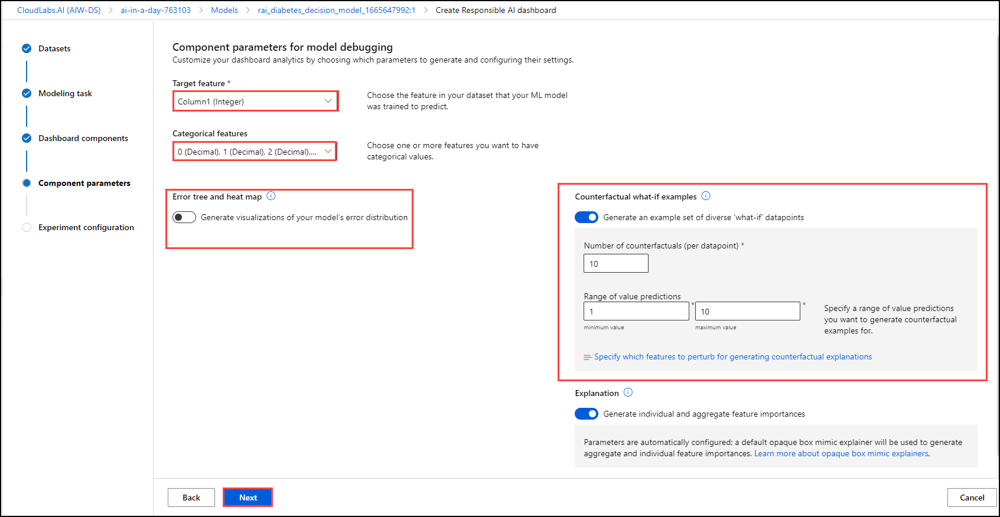

9. In the **Training job or experiment configuration**, page enter the following:

   - **Name** : Give the dashboard a unique name so that you can differentiate it when you’re viewing the list of dashboards for a given model.
   - **Experiment name** : Select an existing experiment to run the job.
   - **Existing experiment** : Select an existing experiment from drop-down.
   - **Select compute type** : Compute cluster
   - **Select compute** : cpucluster

10. Skip the creation of the experiment by clicking the **Cancel** option, since we have already created an RAI dashboard in the environment, this allows you to explore Responsible AI Dashboard experiments without having to wait for the completion of the job run.
    
    

## Task 8 -  How to use the Responsible AI dashboard in AML studio

1. Navigate to **Models** under Assets, from the Model List select the available model, for example: **rai_diabetes_decision_model_1655974567:1**

   

2. On the Models page, select the **Responsible AI** option and select the available RAI dashboard.

   

3. Go through the insights of the RAI dashbaord and select the **Back to models** details to get back to your list of dashboards.

   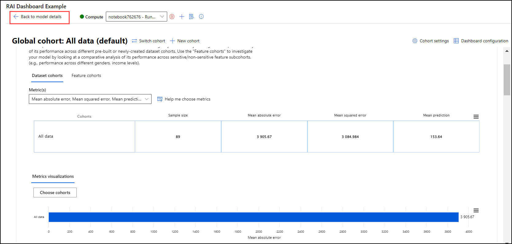

4. Explore through the Dashboard to learn how to enable the Full functionality with integrated compute resources.

> **Note**: For more information about the Responsible AI dashboard, reference this link ```https://docs.microsoft.com/en-us/azure/machine-learning/how-to-responsible-ai-dashboard```

 
