# Lab 2 - Document Processing and Summarization with Azure Form Recognizer and Cognitive Service for Language

This lab covers Azure Cognitive Services, particularly [Azure Cognitive Search](https://azure.microsoft.com/services/search/) and the [Form Recognizer](https://azure.microsoft.com/services/cognitive-services/form-recognizer/) service.

## Task 1 - Explore the dashboard of COVID-19 data

Understanding the source datasets is very important in AI and ML. To help you expedite the process, we have created a Power BI dashboard you can use to explore them at the beginning of each lab.


To get more details about the source datasets, check out the [Data Overview](https://github.com/CloudLabsAI-Azure/ai-in-a-day/blob/main/data-overview.md) section.

To explore the dashboard of COVID-19 data, open the `Azure-AI-in-a-Day-Data-Overview` file located on the desktop (**C:\Users\public\desktop**) 💻 of the virtual machine provided with your environment. If you see the `Introducing the updated mobile layout` pop-up screen, then close it by clicking on `Got it`. Collapse the **Fields** and **Visualizations** tabs to see the clear report.

 

> **Note:** Please close and reopen the Power BI Desktop document if it throws an error on the first attempt.

## Task 2 - Explore lab scenario

Another critical problem to deal with when it comes to the volumes of research documents covering COVID-19 is the problem of advanced indexing and searching their content. The specific internal structure of research papers (including citations, contributors, and various entities like diagnosis, forms of examination, family relations, genes, medication, symptoms or signs, and treatments) form a reach semantic graph that goes way beyond simple document categorization. An analyst would benefit significantly from exploring the corpus of documents in a way that considers all these complex relationships.

Using the Cognitive Search capabilities, we will create a complex index of documents that allows an analyst to perform an advanced search and explore the inter-document graph relationships.

The following diagram highlights the portion of the general architecture covered by this lab.


The high-level steps covered in the lab are:

- Explore dashboard of COVID-19 data
- Explore lab scenario
- Explore the document search process
- Explore the graph search process
- Add a set of new documents and trigger the index update process
- Explore the document and graph search and identify updated results

## Task 3 - Creating Azure Search Indexes

1. Navigate to [the Azure portal](https://portal.azure.com) and log in with your credentials. Then, select **Resource groups**.

    

1. Select the **AI-in-a-Day** resource group.

1. Locate **Search service** resource **aiinaday-cog-<inject key="DeploymentID" enableCopy="false"/>** and select it.

    

1. Copy the search service URL and paste this into a text file. Also make a note of the service account name, which comes before `.search.windows.net`.

    

1. Navigate to the **Keys (1)** under Settings and **copy the Primary admin key (2)**. Paste this into a text file.

    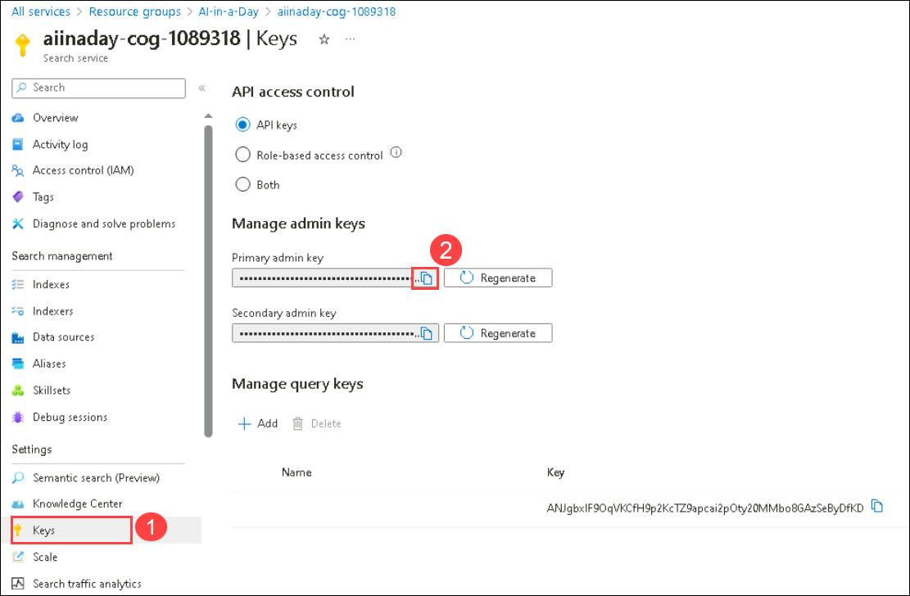

1. Navigate to Storage account named **aiinadaystorage<inject key="DeploymentID" enableCopy="false"/>** **(1)**, select **Access keys** **(2)** under Security + networking from left-menu. Click on **Show** of the connection string under Key1 **(3)** to see the connection string and **copy the connection string** **(4)** under Key1. Paste this into a text file.

   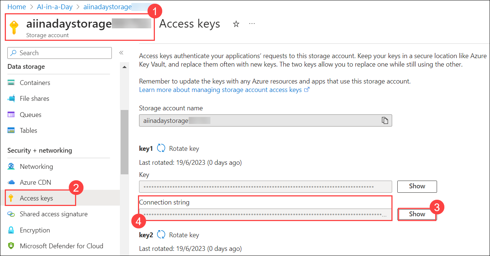

1. Open **File Explorer** from the task bar and navigate to the path `C:\Temp\AzureSearch\`. There are six files, three prefixed with `abstracts` and three with `covid19temp`.

1. Open the `abstracts_datasource.schema` file with a text editor and replace the segment starting `<< TODO:` with your Storage account connection string **<inject key="storageAccountConnectionString" enableCopy="true"/>** and then save the file.

    

1. Open the `covid19temp_datasource.schema` file with a text editor and replace the segment starting `<< TODO:` with your Storage account connection string **<inject key="storageAccountConnectionString" enableCopy="true"/>** and then save the file.

1. Now, open the `AzureSearchIndex.ps1` file with a text editor and copy the code present in it.

1. Open a new PowerShell prompt and navigate to the following directory:

    ```
    cd C:\Temp\AzureSearch\
    ```
 
1. Paste the copied code from the **AzureSearchIndex.ps1** file and press enter to create an Azure Search data source, index, and indexer.

    

1. In the same PowerShell prompt, call this function for the `abstracts` index and the `covid19temp` index.

    Make sure to update the Azure Search account name and Azure Search API key in the below commands and then run.
   
     - Azure Search Account Name: **aiinaday-cog-<inject key="DeploymentID" enableCopy="false"/>**
     - Azure Search API key: You saved the Primary admin key in the text editor in step 5, use that

    ```powershell
    Create-AzureSearchIndex "C:/Temp/AzureSearch/abstracts_datasource.schema" "C:/Temp/AzureSearch/abstracts.schema" "C:/Temp/AzureSearch/abstracts_indexer.schema" "AZURE SEARCH ACCOUNT NAME" "API KEY"
    ```
    
    ```powershell
    Create-AzureSearchIndex "C:/Temp/AzureSearch/covid19temp_datasource.schema" "C:/Temp/AzureSearch/covid19temp.schema" "C:/Temp/AzureSearch/covid19temp_indexer.schema" "AZURE SEARCH ACCOUNT NAME" "API KEY"
    ```

    

## Task 4 - Querying Azure Search Indexes

1. Navigate to [the Azure portal](https://portal.azure.com) and log in with your credentials. Then, select **Resource groups**.

    

2. Select the **AI-in-a-Day** resource group.

3. Locate **Search service** resource **aiinaday-cog-<inject key="DeploymentID" enableCopy="false"/>** and select it.

    

4. Select the **Indexes** tab and ensure that you have two indexes created. If the Document Count is 0 for either, wait a couple of minutes and select **Refresh** until the document count appears.

    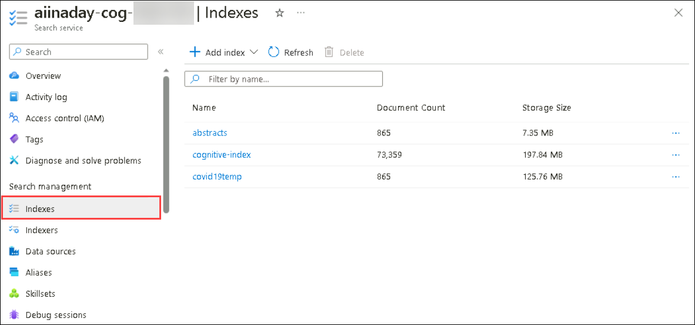

5. Once documents are available, select **Search Explorer** to open up the Search Explorer.

    

6. Choose the **covid19temp (1)** index and enter `RNA interference`**(2)** into the Query string input box, and then select **Search (3)**. This will return the documents which include the phrase "RNA interference."

    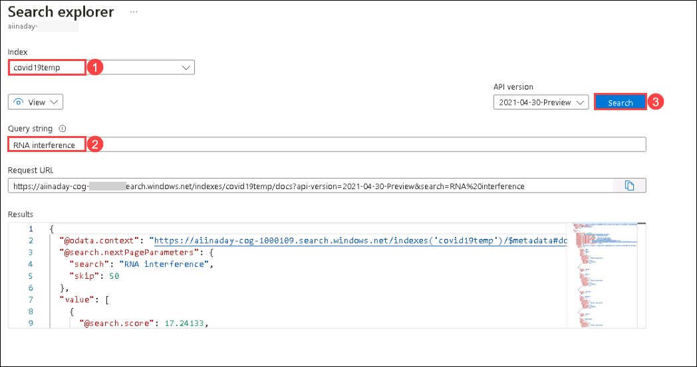

7. We can also see how many articles match a certain search string. In the Query string input box, enter the phrase `Brazil&$count=true` **(1)** and then select **Search (2)**.  This will return 53 documents **(3)**.

    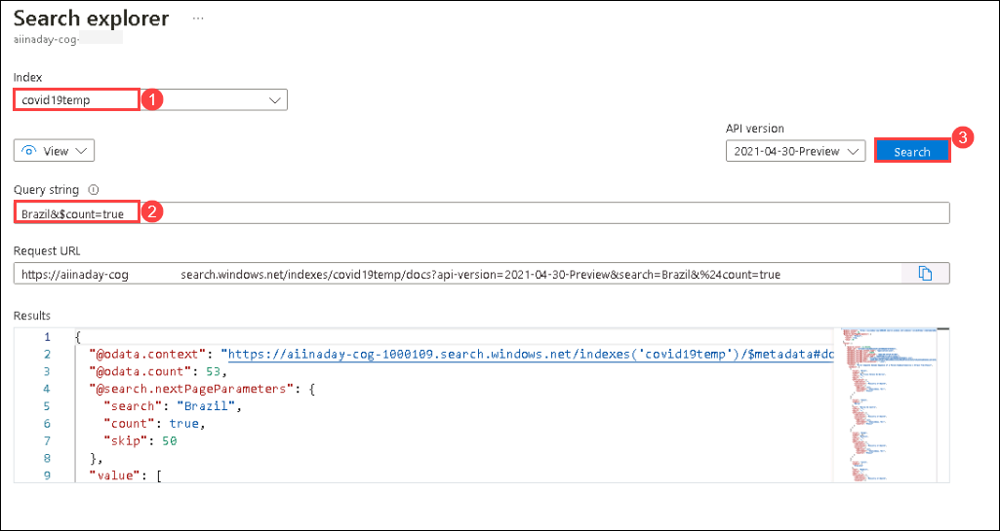

8. Each document returns a large number of fields, but we can specify the fields we would like to see. In the Query string input box, enter the phrase `UNC Chapel Hill&$select=metadata/authors, metadata/title` **(1)** and then select **Search (2)**. This will return the title as well as detailed information on each author.

    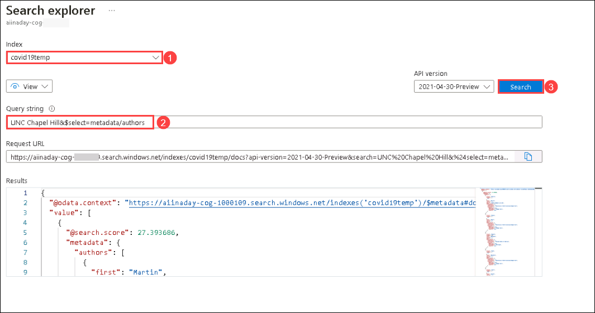

9. The Azure Search service can also generate a demo application. Return to the search service and select the **covid19temp** index.

    

10. Select the **Create Demo App** option.

    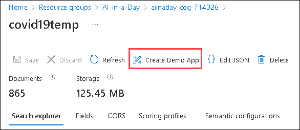

11. On the first tab, select `metadata.title` **(1)** for the Title and `abstract.text` **(2)** for the Description. Then select **Create Demo App (3)**. After the prompt, select **Download** to download an HTML file named `AzSearch.html`.

    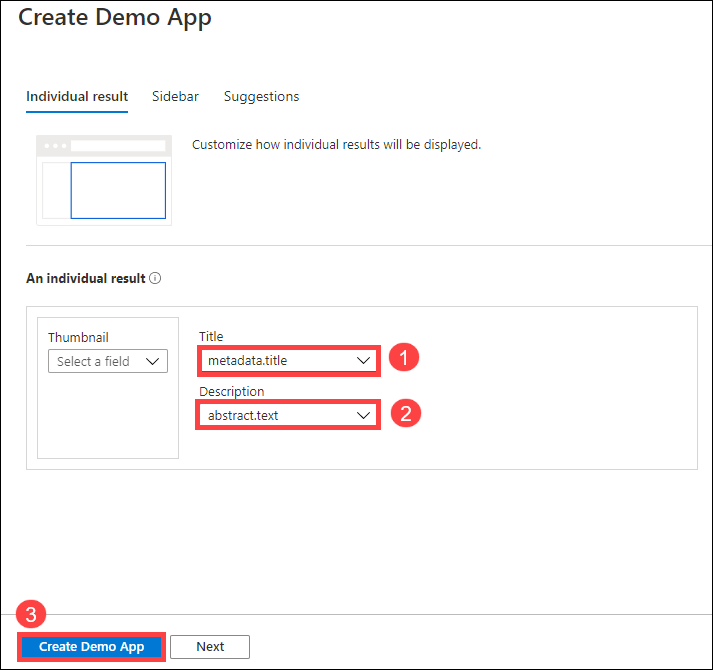

12. Open the demo app HTML file. In the search box, enter the phrase **RNA interference (1)** and select the **Search icon (2)**. This will return 497 papers relating to RNA interference.

    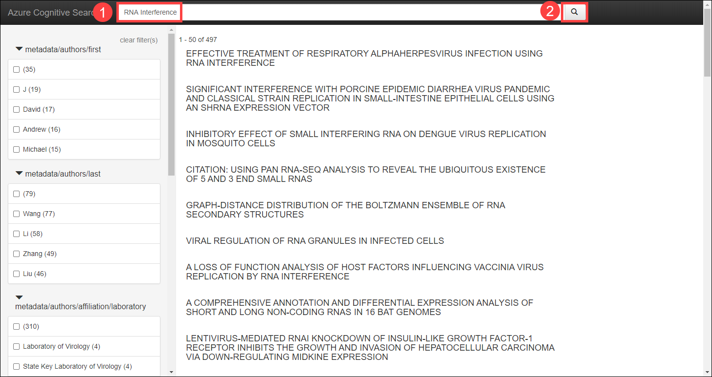

## Task 5 - Updating Azure Search Indexes

1. On the desktop, select the Azure Storage Explorer.  

    

2. Select the **Connect (1)** option and then click on **Storage account or service (2)**.

    

3. Select **Connection String (Key or SAS) (1)** under the Select Connection Method Window and then select **Next (2)**.

    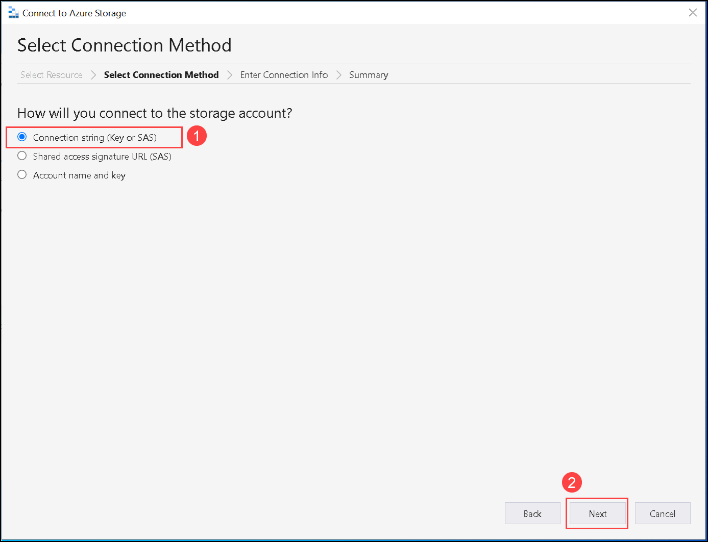

4. Paste in your storage account **Connection string (1)** **<inject key="storageAccountConnectionString" enableCopy="true"/>**. Then, select **Next (2)** to continue and **Connect (3)** to complete the operation.

    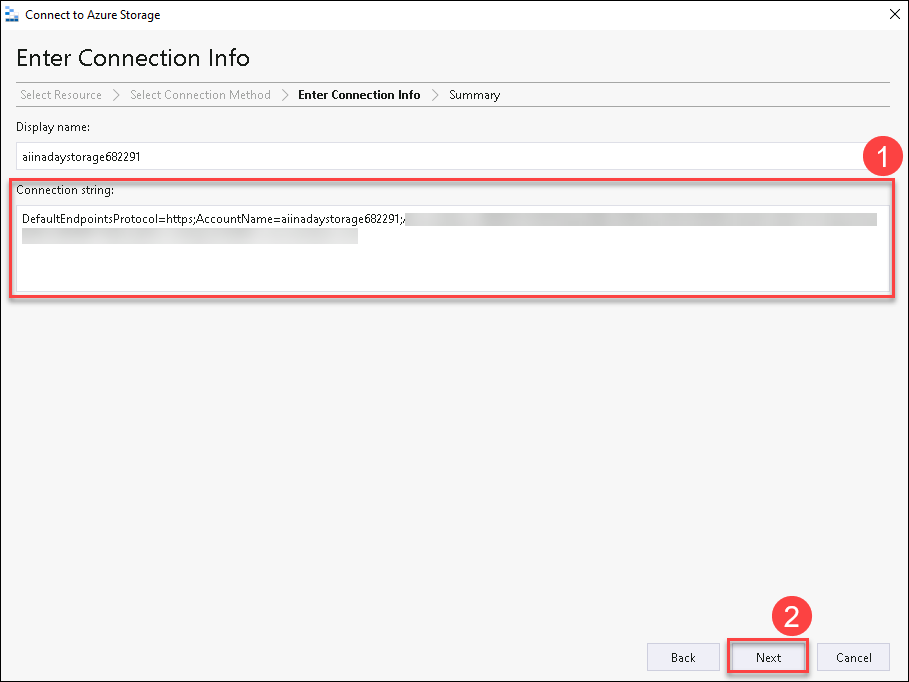

    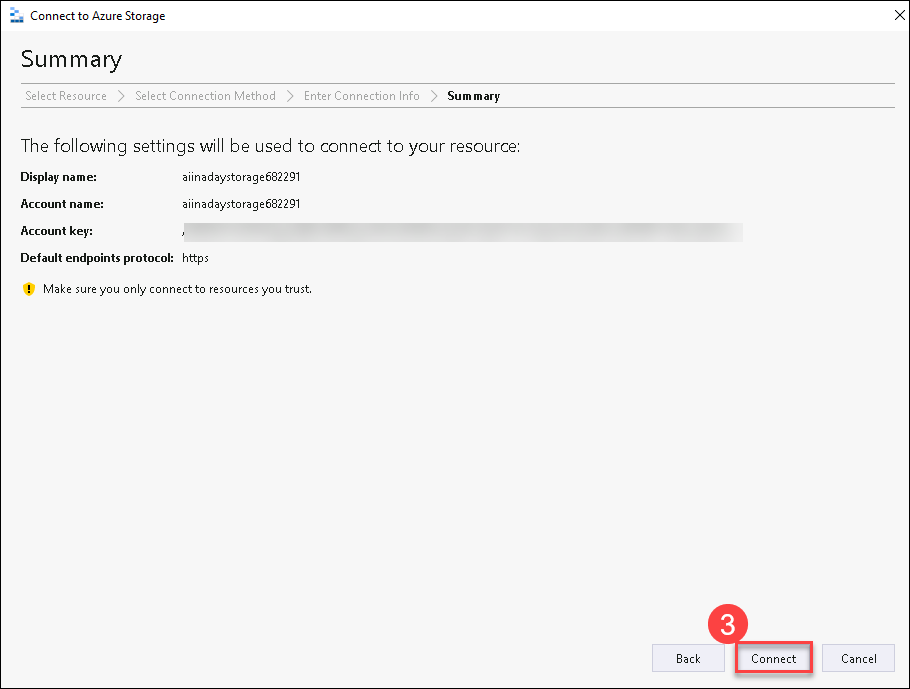

5. In Azure Storage Explorer, navigate down the **aiinadaystorage<inject key="DeploymentID" enableCopy="false"/> (1)** attached storage and expand **Blob containers (2)** expand the **blob container (3)** and select `covid19temp` **(4)**.  Double-click the **comm_use_subset (5)** to enter that folder.

    

6. Enter the **pdf_json_refresh** folder. Then, in the **Select All (1)** menu, choose **Select All Cached (2)**. This will highlight all 100 records in the folder.  Select **Copy (3)** to copy these documents.

    
    
    

7. Navigate up to **comm_use_subset** by selecting the upward arrow and then double-click **pdf_json (1)**. Inside this folder, select **Paste (2)** to paste the 100 documents into the **pdf_json** folder. When it finishes, you should have **965 total documents (3)**.

    

    

8. Navigate to [the Azure portal](https://portal.azure.com) and log in with your credentials if not logged in already. Then, select **Resource groups**.

    

9. Select the **AI-in-a-Day** resource group.

10. Select the **aiinaday-cog-<inject key="DeploymentID" enableCopy="false"/>** Search service.

    

11. Navigate to the **Indexers (1)** section and select the **covid19temp (2)** indexer.

    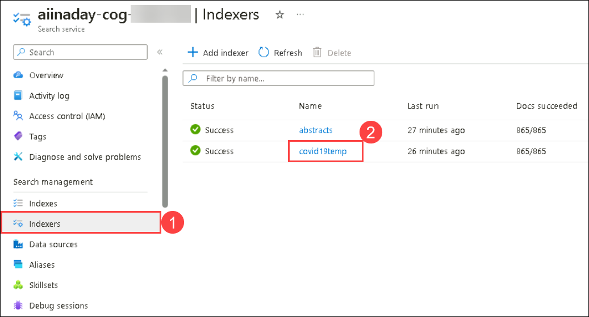

12. Select the **Run (1)** option to process the 100 documents. Although we can configure an indexer to run periodically, this indexer will only run when manually engaged.  Select **Yes (2)** to run the indexer.

    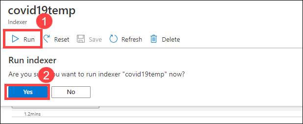

13. The indexer will run. It should be completed within 15-30 seconds to process the 100 new documents. You may need to select **Refresh** to see the indexer's progress.

    

14. Return to the **Indexes** tab for the Search service and ensure that the **covid19temp** index has 965 documents. If it still reads 865, wait 30 seconds and select **Refresh** to check again.

    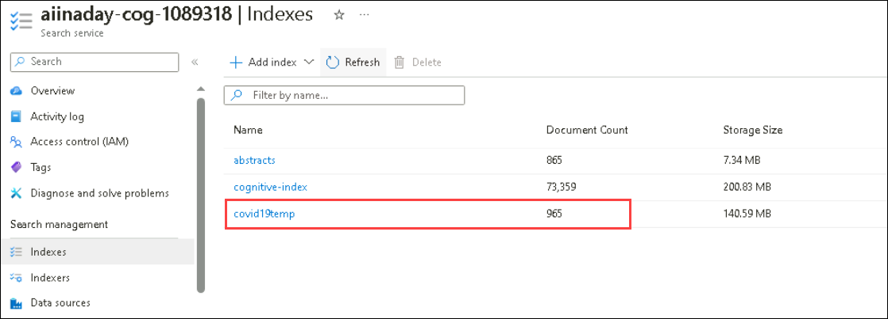

15. Select the **covid19temp** index to return to the Search Explorer. When we had 865 documents, 53 of them pertained to Brazil. We can confirm that this update was successful by entering `Brazil&$count=true` **(1)** and selecting **Search (2)**. This will now return 57 results **(3)** instead of the prior 53.

    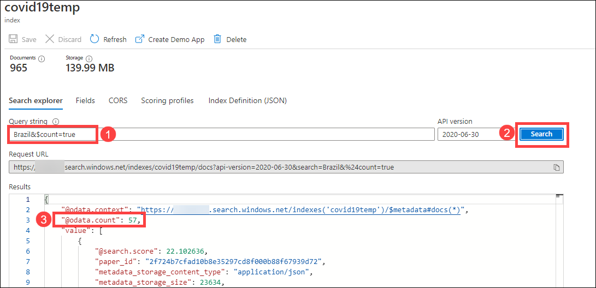

## Task 6 - Using the Form Recognizer Studio

1. Navigate to [the Azure portal](https://portal.azure.com) and log in with your credentials. Then, select **Resource groups**.

    

2. Select the **AI-in-a-Day** resource group.

3. Select the **aiinadaystorage<inject key="DeploymentID" enableCopy="false"/>** Storage account.

    

4. Under **Settings**, navigate to the **Resource sharing (CORS)** page. 

    
    
5. On the Resource Sharing (CORS) page, ensure that you are on the **Blob service** **(1)** tab, and enter the following values into the table **(2)** and then select **Save** **(3)** to save the CORS settings.  

   | Parameter                   | Value                                              |
   | --------------------------- | -------------------------------------------------- |
   | Allowed origins             | Enter `https://formrecognizer.appliedai.azure.com` |
   | Allowed methods             | Select all of the available methods.               |
   | Allowed headers             | Enter `*`                                          |
   | Exposed headers             | Enter `*`                                          |
   | Max age                     | Enter `200`                                        |

   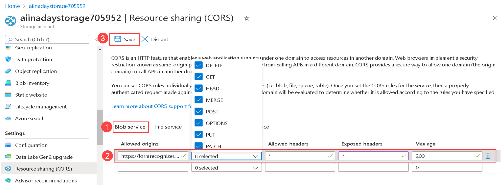


6. Return to the Azure Portal page with your storage account. Navigate back to the **AI-in-a-Day** resource group and select the Document Intelligence resource **aiinaday-formrecog<inject key="DeploymentID" enableCopy="false"/>**.

    

7. Select the **Keys and Endpoint** **(1)** option under Resource Management and click on **Show Keys** **(2)**. Then, copy the value for **KEY 1** **(3)** and the **Endpoint** **(4)**. Paste these into a text file for later use.

    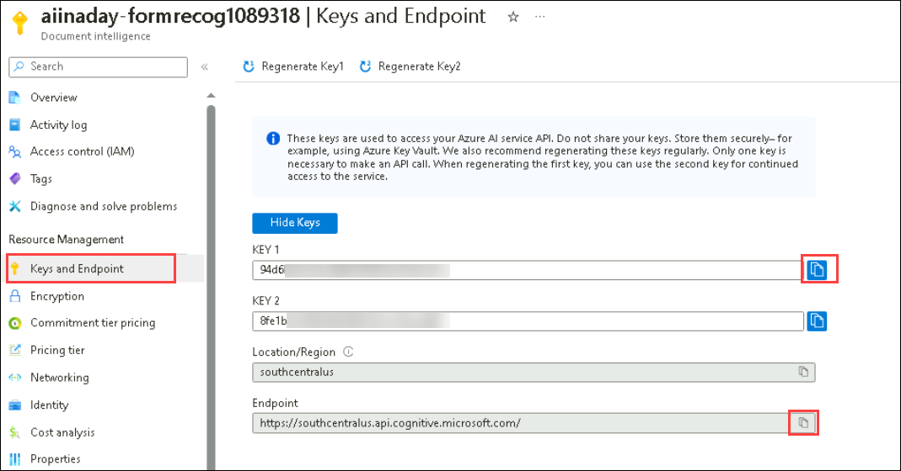

8. Navigate to the [Document Intelligence Studio](https://formrecognizer.appliedai.azure.com/), scroll-down to **Custom models** and select **Create new** under **Custom model**. Use the credentials provided in the Environment Details to Sign-in.

    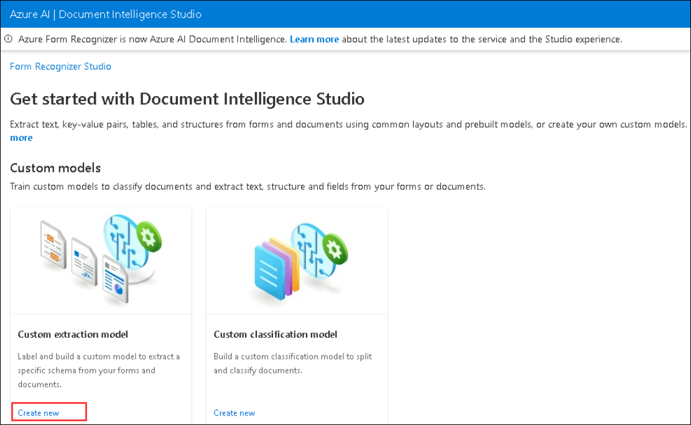

9. In the Custom models page, under **My Project** click on **+ Create a project**.
  
    

10. In the Enter Project Details pane, enter the Project Name as **covid19abstract (1)** and add the description as **Extracting Abstract from the documents (2)**. Click on **Continue (3)**.

    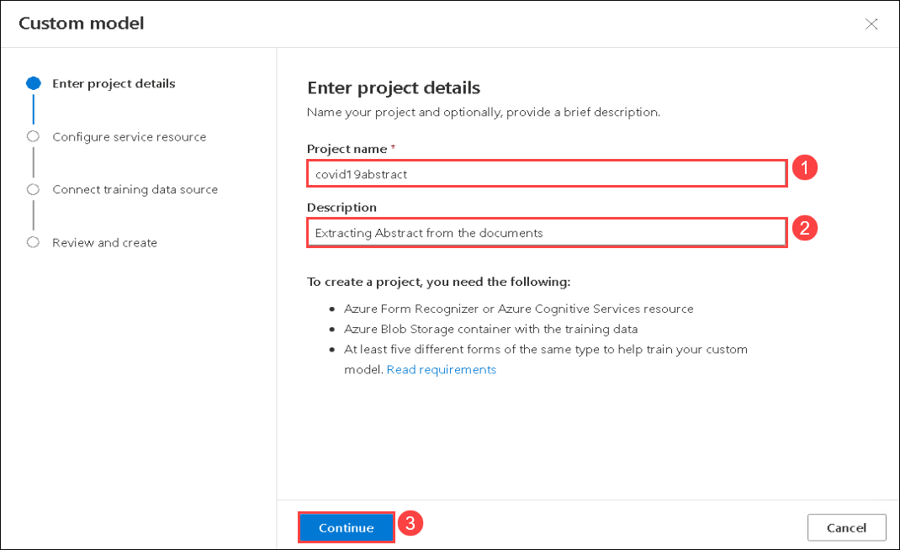
    
11. In the **Configure service resource**, provide the following details and click on **Continue (4)**.
   
    | Parameter                   | Value                                |
    | --------------------------- | -------------------------------------|
    | Subscription                | Select the default subscription  **(1)**    |
    | Resource Group              | Select `AI-in-a-Day` **(2)**                |
    | Form Recognizer or Cognitive Service Resource| aiinaday-formrecog<inject key="DeploymentID" enableCopy="false"/> **(3)**|
    

    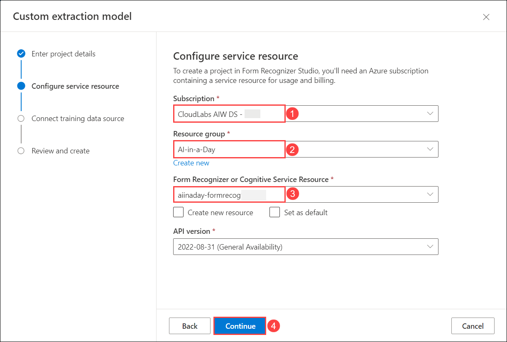
    
12. Next in the connect training data source, select the below values from the drop-down and click on **Continue (6)**.

    | Parameter                   | Value                                |
    | --------------------------- | -------------------------------------|
    | Subscription                | Select the default subscription **(1)**     |
    | Resource Group              | Select `AI-in-a-Day` **(2)**                |
    | Storage account             | Select aiinadaystorage<inject key="DeploymentID" enableCopy="false"/> **(3)** |
    | Blob container              | Select `covid19temp` **(4)**                 |
    | Folder path                 | Enter `papers` **(5)**                      |

    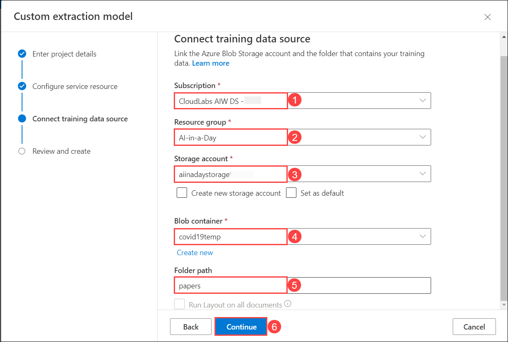
    
    > **Note**: If you are unable to select the Storage Account in the Connect training data source page, signout and signin from the Form Recognizer Studio with the given credentials. Re-perform the task from Step-8.

13. Review the details and click on **Create project**.

    
  
14. After creating a new project, you will be sent to the project for tagging in Label data. Select **+** **(1)** to create a new **Field** **(2)**, type `Abstract` in the Field, and hit enter. By this, you have created a new Abstract Field.

    
    
    

15. Click on **Run layout**.Wait for the layout to be run for the first document and locate the document's abstract. Note that for some documents, the abstract is on the second page. Then, move on to the next document. We will tag each of the five papers, so navigate to each in turn, allowing the layout to be run. In order for tagging to be successful, we must first run the layout of a document, navigate to another document, and return to this first document before we begin tagging. Layout generation happens once per document, after which we can return to it and tag our abstract.

    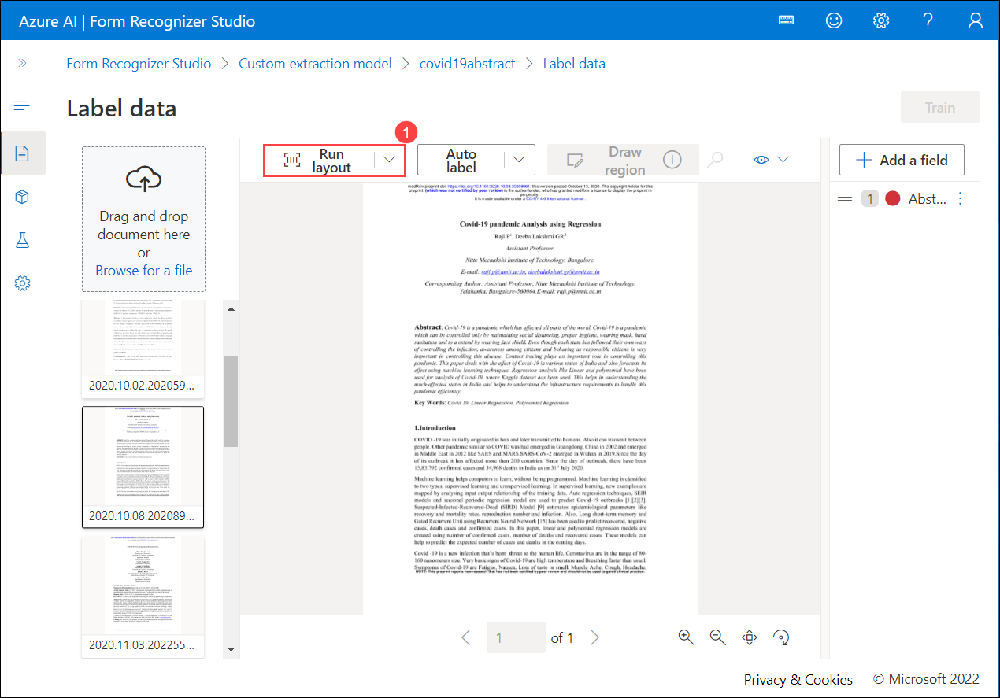

    

16. Return to the second PDF and select each word in the **Abstract** section. After highlighting this, select the **Abstract** tag to tag this section. Note that you will need to select each word individually rather than selecting a box. After selecting the **Abstract** tag, you should see a tag logo next to the PDF. If you see the tag logo, this means that tagging was successful for this document.

    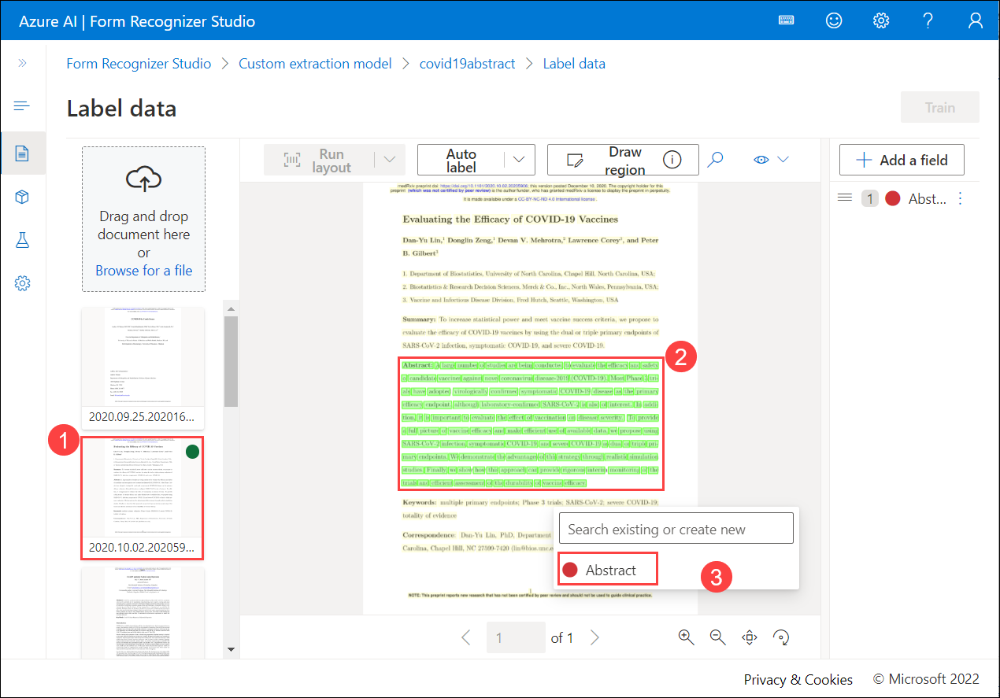

17. Return to the first PDF and highlight the word **ABSTRACT** and the abstract. If the abstract is lengthy, as in this example, it is okay to include just the first paragraph. Then, select the **Abstract** tag to tag this document. Ensure that the viewed icon (an eye) changes to a tag icon. If it does not change to a tag but instead changes to a blank spot without any icons, tagging was unsuccessful. In the event that tagging is unsuccessful, select another document, wait for it to have its layout run, and then return to the prior document and try tagging again.

    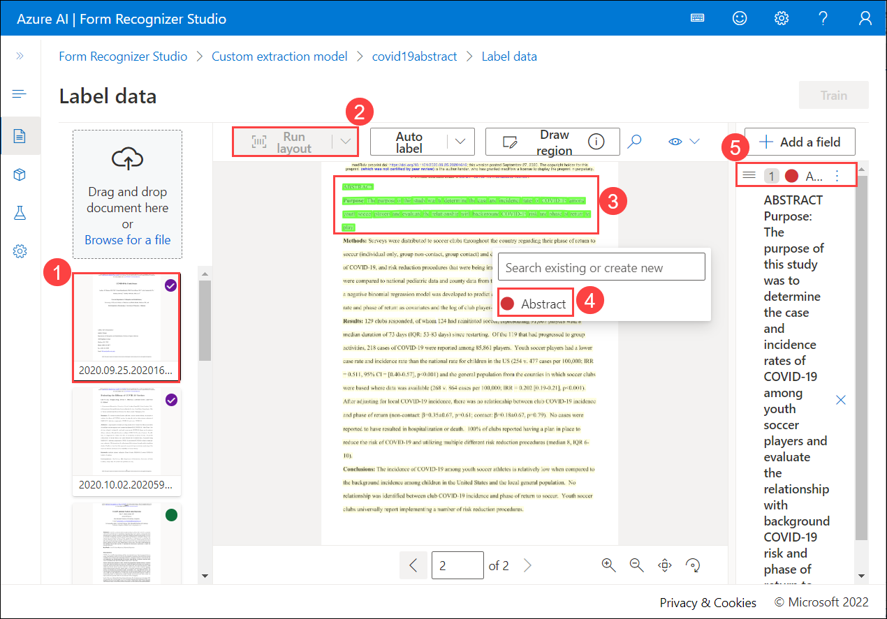

18. Continue tagging until all five of the top papers are tagged. Once we have tagged five documents, select the **Train** option.
    
    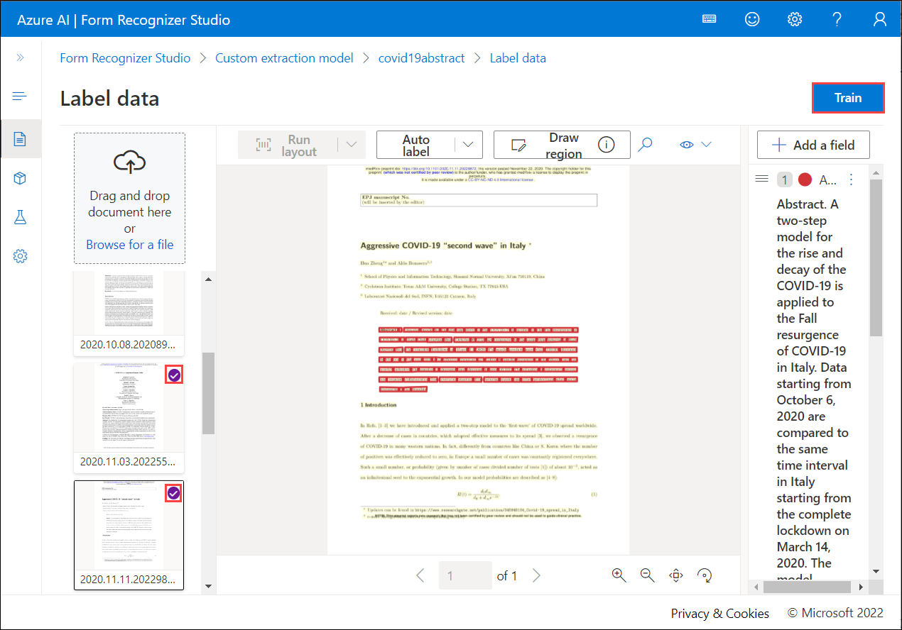

19. In a pop-up to Train a new model, enter **Abstracts (1)** as the ModelID, and select the **Neural (Recommended) (2)** from the drop-down as Build Mode. Then click on **Train (3)**.

    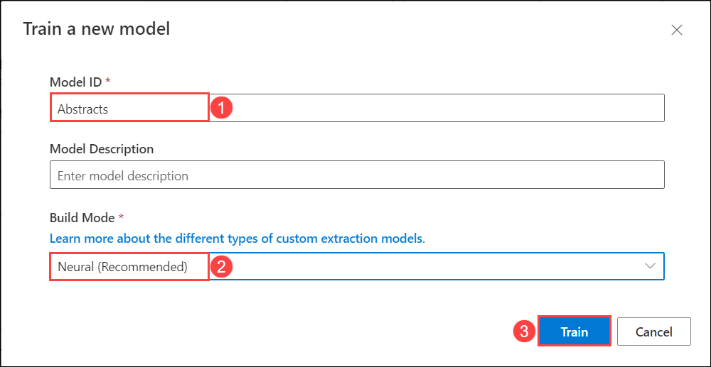

20. Training a model may take up to 10-15 minutes to succeed. Click on **Go to models**. 

    

21. After the model has finished training, you will see that the Status has succeeded.  Although the estimated accuracy is not great, we will use this model.

    

22. From the left menu, select the **Test (1)**. Click on **Browse for a file (2)**. 

    * In the Upload Files pop-up, click on **Choose file** **(1)**. Navigate to `C:\Temp\AzureSearch\`, select `2020.09.25.20201616v1.pdf` file **(2)** and then click on **Add file** **(3)**.
    
     
   
    *  Choose `2020.09.25.20201616v1.pdf` file **(3)** select **Analyze (4)**. Note that the abstract is on **page 2 (5)** of the PDF. View the **Results (6)** on the right side of the page.
    
      

23. Select **Result (1)** and click on **download icon (2)** to download JSON file. Find the location where the script was downloaded and observe the result code.

    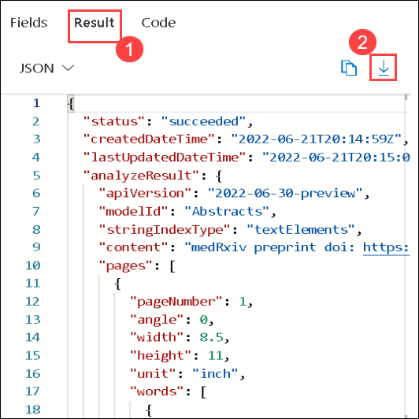
    
24. For now, you have used custom models with Neural build mode. You can use any sample document which contains Tables and Signatures to Test/Analyze using Template build mode. Please find the reference to explore more about Form Recognizer Studio: [Quickstart: Form Recognizer Studio - Azure Applied AI Services | Microsoft Docs](https://docs.microsoft.com/en-us/azure/applied-ai-services/form-recognizer/quickstarts/try-v3-form-recognizer-studio)

## Task 7 - Document Summarization via Cognitive Service for Language Integration

Summarization is one of the features offered by [Azure Cognitive Service for Language](https://docs.microsoft.com/en-us/azure/cognitive-services/language-service/overview), a collection of machine learning and AI algorithms in the cloud for developing intelligent applications that involve written language. Use this article to learn more about this feature, and how to use it in your applications.

In general, there are two approaches for automatic document summarization: extractive and abstractive. This API provides extractive summarization. Extractive summarization is a feature that produces a summary by extracting sentences that collectively represent the most important or relevant information within the original content. This feature is designed to shorten content that users consider too long to read. Extractive summarization condenses articles, papers, or documents to key sentences. The AI models used by the API are provided by the service, you just have to send content for analysis.

In this task, we are creating a text summarization application with the client library for Python. You will create a Python application that can summarize documents or text-based customer service conversations.

1. Return to the Azure Portal page and navigate to the **AI-in-a-Day** resource group and select the Azure AI services multi-service account **aiinaday-cogsv<inject key="DeploymentID" enableCopy="false"/>**.

    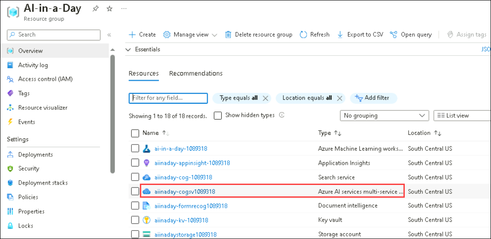

2. Select the **Keys and Endpoint (1)** option under Resource Management.  Then, copy the value for **KEY 1 (2)** and the **Endpoint (3)**.  Paste these into a text file for later use.

    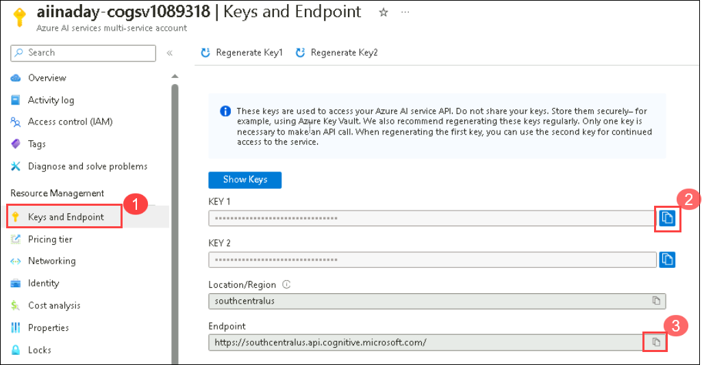

3. In the labvm, open a command prompt (`cmd.exe`). To do this, open the Windows menu, type in `cmd`, and select the **Command Prompt** application.

    

4. Run the below command. To run this, you must have Python installed on the machine. If `python.exe` is not accessible as part of the path--meaning you get an error when trying to run `pip`, navigate to where Python is installed.  The `pip.exe` program is inside the `\Scripts\` folder.

    ```bash
    pip install azure-ai-textanalytics==5.2.0b1
    ```

    

5. Open **File Explorer** and navigate to the path `C:\Temp\AzureSearch\`. Select the file named **summarization.py** and open it in **Notepad or IDLE**. 

6. Replace the **key** and **endpoint** in the file with Cognitive services multi-service account named **aiinaday-cogsv<inject key="DeploymentID" enableCopy="false"/>** which you have already copied in step-2 of the same task and finally save the file.
    
    

7. Navigate to the command prompt and run the following commands.

   ```bash
   cd C:\Temp\AzureSearch\
   ```
   ```bash
   python summarization.py
   ```
   
   

You can find more references about Document Summarization from here: [Quickstart: Get started with Language Studio - Azure Cognitive Services | Microsoft Docs](https://docs.microsoft.com/en-us/azure/cognitive-services/language-service/language-studio). Use this article to learn about Language Studio, and testing features of Azure Cognitive Service for Language Integration.
