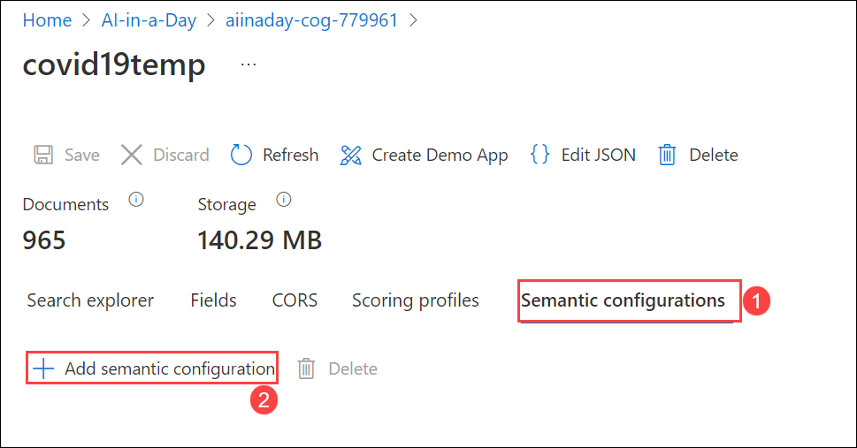
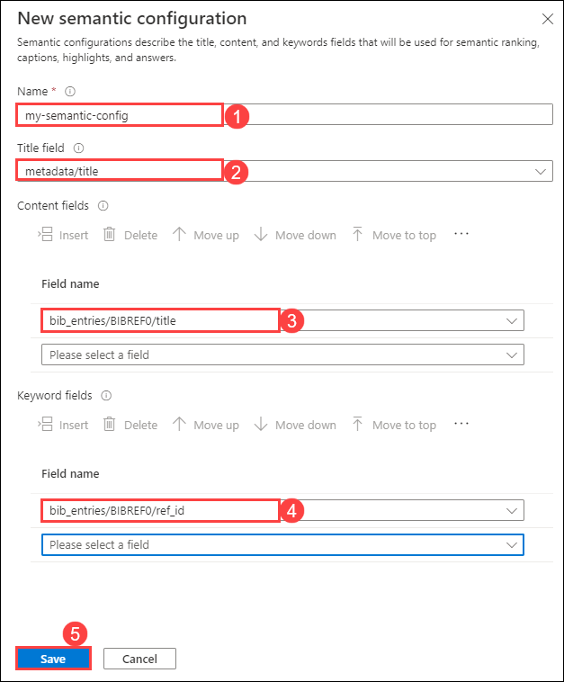
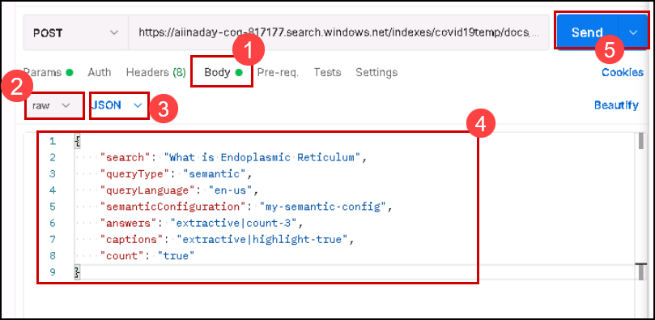

# Lab 2b - Knowledge Mining with Azure Cognitive Search

This lab covers Azure Cognitive Search Services, particularly [Semantic ranking](https://docs.microsoft.com/en-us/azure/search/semantic-ranking) using [semantic query](https://docs.microsoft.com/en-us/azure/search/semantic-how-to-query-request?tabs=semanticConfiguration%2Cportal#create-a-semantic-configuration) and [return a semantic answer](https://docs.microsoft.com/en-us/azure/search/semantic-answers?tabs=semanticConfiguration).

Semantic search is a premium feature in Azure Cognitive Search that invokes a semantic ranking algorithm over a result set and returns semantic captions (and optionally semantic answers), with highlights over the most relevant terms and phrases. Both captions and answers are returned in query requests formulated using the "semantic" query type.

The semantic ranking is an extension of the query execution pipeline that improves precision by reranking the top matches of an initial result set. In order to complete processing within the expected latency of a query operation, inputs to the semantic ranker are consolidated and reduced so that the underlying summarization and reranking steps can be completed as quickly as possible.

## Task 1 - Enabling the Semantic search (preview) in the Cognitive Search service

1. Navigate to **AI-in-a-Day** resource group in the [Azure portal](https://portal.azure.com).

2. Locate **Search service** resource **aiinaday-cog-<inject key="DeploymentID" enableCopy="false"/>** and select it.

   
   
3. Select the **Semantic search (preview)** under settings in the left menu.

   
   
4. From the Semantic search (preview) pane, select the **Free** tier by clicking on **Selected Plan**. Once you click on select plan, a free tier plan will be selected for Semantic search.

   
   
## Task 2 - Creating a Semantic configuration

1. Navigate to **Overview** **(1)** of **Search service** resource **aiinaday-cog-<inject key="DeploymentID" enableCopy="false"/>** and then select **Indexes** **(2)**. You will be able to see the list of indexes, click on **covid19temp** **(3)** index for adding semantic configuration.

   
   
2. In the **covid19temp** index pane, select **Semantic configurations** **(1)** and click on **+ Add semantic configuration** **(2)**.

   

3. You will see a tab appears on the right-side with **New semantic configuration**. Enter the below values:

    | Parameter                   | Value                                        |
    | --------------------------- | -------------------------------------------- |
    | Name (1)                    | my-semantic-config                           |
    | Title field (2)             | Select `metadata/title` from the drop-down   |
    | Field name under Content fields (3) | Select `bib_entries/BIBREFO/title` from the drop-down |
    | Field name under Key fields (4)    | Select `bib_entries/BIBREFO/ref_id` from the drop-down |
  
   Click on **Save** **(5)**.
  
   
  
4. You will be able to see the added semantic configuration **(1)** under the Semantic configurations tab. Click on **Save** **(2)** to save the changes made.

   

## Task 3 - Semantic search using the semantic configuration in Azure Portal

1. Navigate to **Overview** **(1)** of **Search service** resource **aiinaday-cog-<inject key="DeploymentID" enableCopy="false"/>** and then click on **Search explorer (2)**.

   
   
2. In the **Search explorer** pane, select the Index **covid19temp** **(1)** from the drop-down and click on the downward arrow to expand the **Query options (Preview)** **(2)**. Turn **On** **(3)** the Semantic search (preview), select **my-semantic-config** **(4)** from the drop-down under Semantic configuration, which you created in the previous task. Click on **Search** **(5)**.

   
   
3. Wait for a few seconds to complete the search and scroll down to the **Results** part on the same page. You will be able to see the output for the semantic search using semantic configuration.

   
   
## Task 4 - Semantic Query using REST APIs

In this task, you are going to perform the semantic search using a query in [REST APIs](https://docs.microsoft.com/en-us/azure/search/search-get-started-rest). For now, you will perform with [Postman desktop app](https://www.getpostman.com/) to send requests to Azure Cognitive Search.

1. In the **Search service** resource **aiinaday-cog-<inject key="DeploymentID" enableCopy="false"/>** pane, select **Keys** under settings from left menu.

   
   
2. Make sure to copy **key**, which you can find below the **Manage query keys**, and save it in the text file for later use.

   
   
3. Navigate to **LABVM Desktop** and open the **Postman** application by double-clicking on it.

   
   
4. In the Overview page of the Postman app, click on **Create a request** under Get started.

   
   
5. Select the **POST (1)** Method from the drop-down. Enter request URL given below and make sure to replace the search service name as **aiinaday-cog-<inject key="DeploymentID" enableCopy="false"/>** and index name as **covid19temp**.

   `https://[search-service-name].search.windows.net/indexes/[index-name]/docs/search` **(2)**.
   
   

6. In Parameters section, enter the below values for **api-version** **(1)** and **api-key** **(2)**.

    | Parameter           | Value                                        |
    | --------------------| -------------------------------------------- |
    | api-version         | 2021-04-30-Preview                           |
    | api-key             | Enter the manage query key which you have copied earlier in Step - 2    |
   
   After updating the parameters, your **Request URL** **(3)** should be the same as shown in the below screenshot.
   
   

7. For adding a query, you need to select the **Body** **(1)** section. Then click on **raw** **(2)** as code type and select **JSON** **(3)** as an extension from the drop-down. Copy-paste the query which is given below into the **coding area** **(4)** and click on **Send** **(5)**.

   ```bash
   {
       "search": "What is Endoplasmic Reticulum",
       "queryType": "semantic",
       "queryLanguage": "en-us",
       "semanticConfiguration": "my-semantic-config",
       "answers": "extractive|count-3",
       "captions": "extractive|highlight-true",
       "count": "true"
   }
   ```
   
   
   
8. You will see a **Sending request** in the **Response** section, which will take a few seconds to get the response from the cognitive search service. Once you get the response check that **Network Status: 200 OK**, review the response and explore with your query requests.

   
   
   >**Note**: If you face an issue that the request failed with 401 Forbidden or 403 Forbidden error, this might be caused due to passing invalid authentication credentials or invalid api-key. For more information, reference this link ```https://docs.microsoft.com/en-us/rest/api/searchservice/http-status-codes#common-http-status-codes```
