# Lab 4 - Conversational AI with Bot Service using Power Virtual Agents

This lab covers Power Virtual Agents as the hero bot service and demonstrates how to use the Copilot option to create a bot.

## Task 1 - Explore lab scenario

The power of Machine Learning also comes into play when dealing with human-to-machine interfaces. While classical interfaces like native or web applications are ubiquitous, the new approaches based on conversational AI are becoming increasingly popular. Having the capability to interact with intelligent services using natural language is quickly becoming the norm rather than the exception. Using Conversational AI, analysts can find the research of interest by using simple natural language phrases.

With Machine Learning (ML) and Natural Language Processing (NLP), Human Machine Interface (HMI) technologies are enjoying an increased adoption year over year. By 2021, [the growth of chatbots in this space is expected to be 25.07%](https://www.technavio.com/report/chatbot-market-industry-analysis).


The way organizations are building conversational systems is evolving, with bots being built and maintained by a mix of technical and non-technical roles. Power Virtual Agents has the capability to extend its capabilities by allowing pro-code users to create dialogs/topics using the Azure Bot Framework Composer today. This experience allows technical and non-technical teams to build and host their solutions on a single platform.


## Task 2 - Setting up Microsoft Copilot Studio and Create your first Copilot

1. Navigate to **[Microsoft Copilot Studio page](https://www.microsoft.com/en-us/copilot/microsoft-copilot-studio)** and select **Try Free**. 

   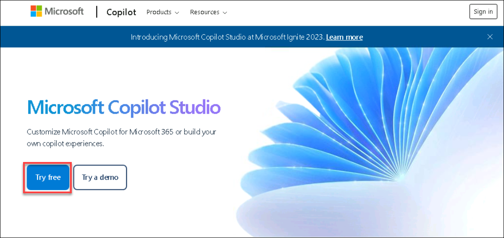

3. On the **Let's get you started**, enter your azure username **(1)** and select **Next (2)**. Then click on **Sign in.** 

   
   

5. Once **Signed in**, under Create your account, **choose your respective region (1)** from the drop-down menu and enter phone number and click on **Get Started (2)**.
   
   
   
6. Under the **Confirmation details (1)**, click on **Get Started (2)**.

    

7. You have now successfully signed up for **Microsoft Copilot Studio**.

8. On the **Welcome to Microsoft Copilot Studio (1)** page, choose your respective region and select **Get Started (2)**.

   

9. On the **Create a Copilot** page enter the following details:

   - **Copilot name (1)**: Enter **AI-Bot-<inject key="DeploymentID" enableCopy="false"/>**.
   - **What language will your bot speak? (2)**: Select **English (US)** from the dropdown.

   Now select **Create (3)**.

   

10. Once the Bot is created you will see the Copilot Studio page.

   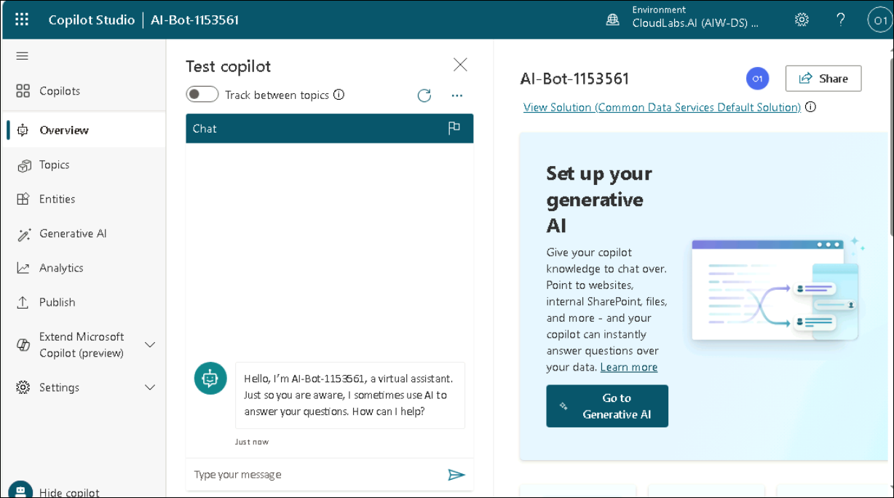

## Task 3 - Create a New Topic

1. One the **Microsoft Copilot Studio** page, select **Topics** **(1)**, **Add** **(2)**, click on **Topic** **(3)** from the drop down menu select **Create from description** **(4)**.

   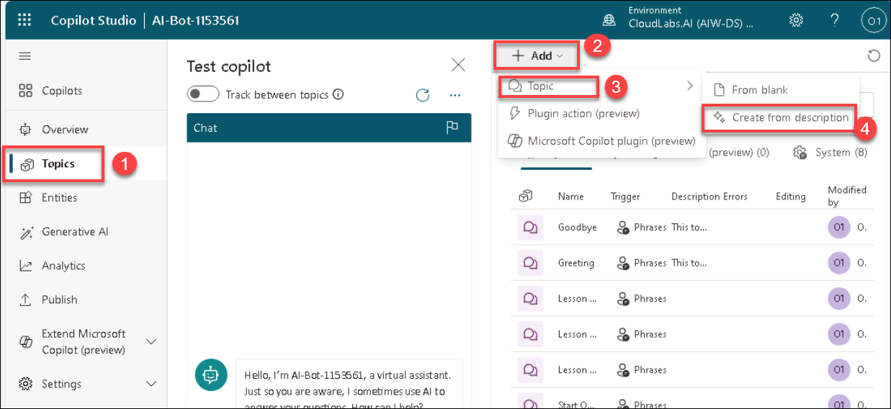

2. In Create it with Copilot pane, Name your topic as **Meal delivery options** **(1)**. In Create a topic to ..., enter the given phrase "**Checking for food options based on the city you are in**" **(2)**, then click on **Create** **(3)**.

   

3. Once you are in the topic pane, **close** the edit with copilot pane from right-side.

4. On the **topics** pane, click on **+** at the bottom of the **Question** node to **Add node**.

   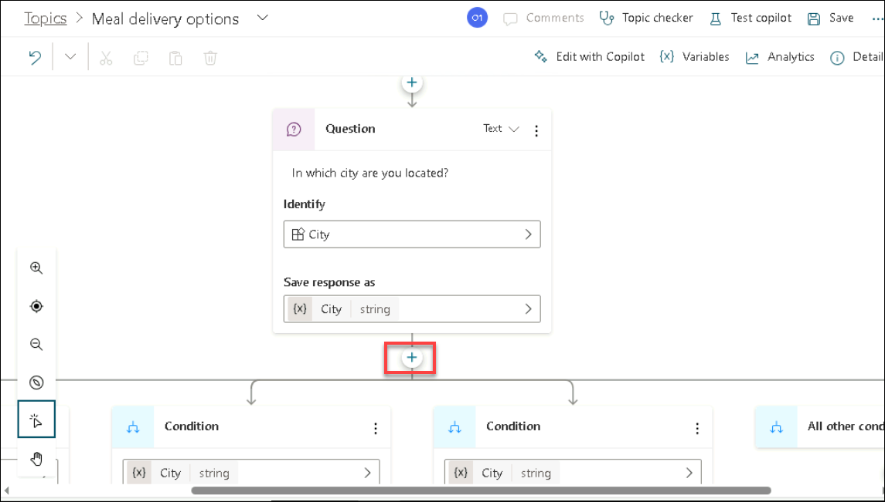

5. Select **Ask a question** from the drop-down while adding a node.

   

6. Enter the question as "**What type of food would you like to order?**" **(1)** and under options for users, click on **New option** **(2)** to add types of food. Add **Chinese** and **Italian** **(3)** as shown in the below screenshot.

    
   
7. Now under Condition of Chinese, click on **+** to Add node.

   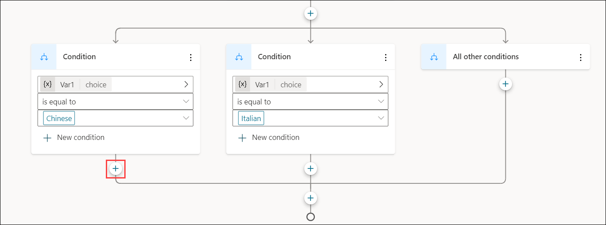

8. Select **Send a message** from the drop-down while adding a node.

   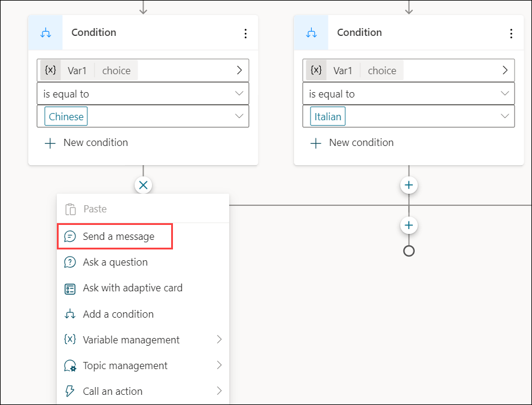

9. Enter the Chinese food items given here in the message section: **Noodles, Spring Rolls, Fried Chicken**

   

10. Now under Condition of Italian, click on **+** to Add node.

    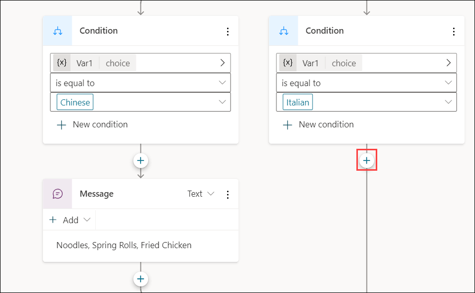

11. Select **Send a message** from the drop-down while adding a node.

    

12. Enter the Italian food items given here in the message section: **Pizza, Pasta, Truffles**

    

13. Review the topic trigger, and click on **Save** from the right-top corner to save the topic.

    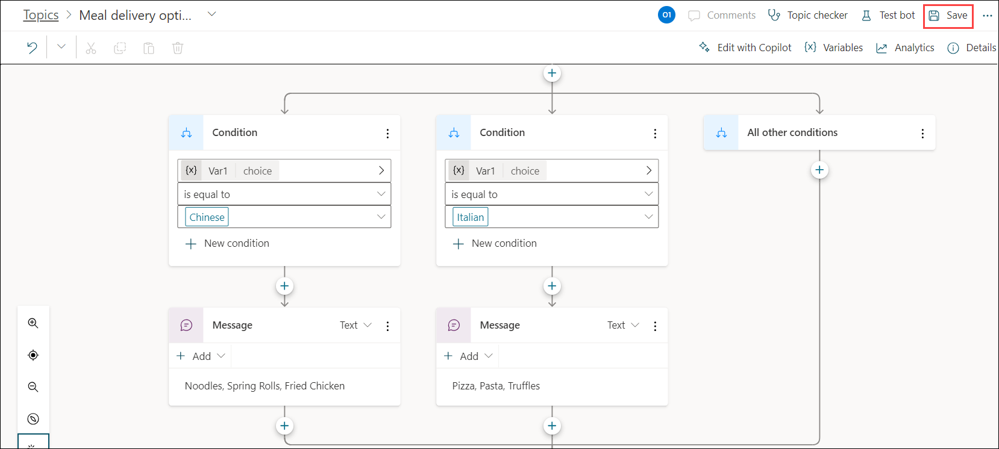

    <validation step="1f3092c6-421b-4e88-8fe6-b5cb70ca1396" />

    > **Congratulations** on completing the task! Now, it's time to validate it. Here are the steps:
    > - Click the Lab Validation tab located at the upper right corner of the lab guide section and navigate to the Lab Validation tab.
    > - Hit the Validate button for the corresponding task.
    > - If you receive a success message, you can proceed to the next task. If not, carefully read the error message and retry the step, following the instructions in the lab guide.
    > - If you need any assistance, please contact us at labs-support@spektrasystems.com. We are available 24/7 to help you out.


## Task 4 - Test your Copilot

1. Once the Topic is saved, click on **Test Copilot** from the right-top corner.

   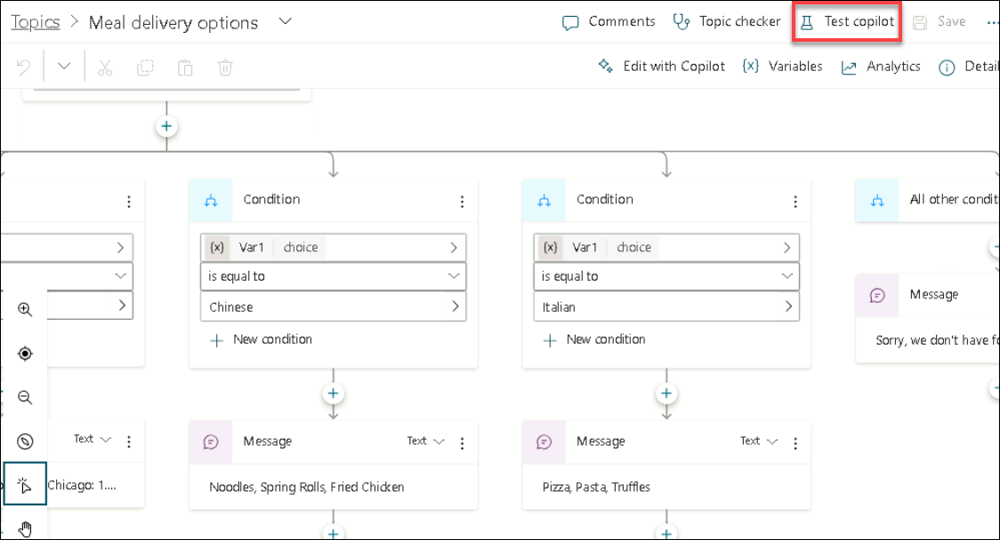

2. In the Test copilot pane, enter the given phrase ```What are my meal delivery options?``` and then enter the city name as ```Seattle```. 

   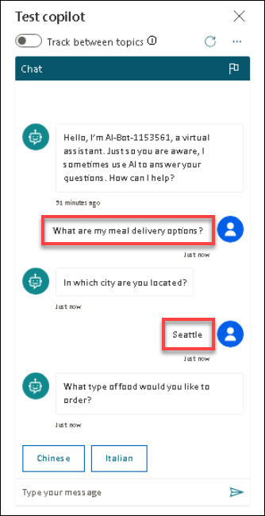

3. You can select the type of food that you are looking for i.e., Chinese or Italian. 

4. Your chatbot should display the names of the meals as shown below.

   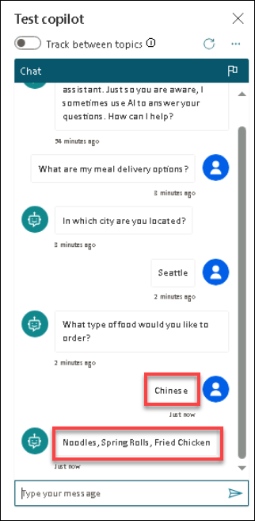

Now you have successfully created and tested the Microsoft Copilot.
