# Lab 4 - Conversational AI with Azure Bot Service and Cognitive Services

This lab covers Power Virtual Agents as the hero bot service and demonstrates how to use Copilot option to create bot.

## Task 1 - Explore dashboard of COVID-19 data

Understanding the source datasets is very important in AI and ML. To help you expedite the process, we have created a Power BI dashboard you can use to explore them at the beginning of each lab.


To get more details about the source datasets, check out the [Data Overview](https://github.com/CloudLabsAI-Azure/ai-in-a-day/blob/main/data-overview.md) section.

To explore the dashboard of COVID-19 data, open the `Azure-AI-in-a-Day-Data-Overview` file located on the desktop (**C:\Users\public\desktop**) 💻 of the virtual machine provided with your environment. If you see `Introducing the updated mobile layout` popup screen, then close it by click on `Got it`. Collapse the **Fields** and **Visualizations** tabs to see the clear report.

> **Note:** Please close and reopen the Power BI Desktop document if it throws an error in the first attempt.

 

## Task 2 - Explore lab scenario

The power of Machine Learning also comes into play when dealing with human-to-machine interfaces. While classical interfaces like native or web applications are ubiquitous, the new approaches based on conversational AI are becoming increasingly popular. Having the capability to interact with intelligent services using natural language is quickly becoming the norm rather than the exception. Using Conversational AI, analysts can find the research of interest by using simple natural language phrases.

With Machine Learning (ML) and Natural Language Processing (NLP), Human Machine Interface (HMI) technologies are enjoying an increased adoption year over year. By 2021, [the growth of chatbots in this space is expected to be 25.07%](https://www.technavio.com/report/chatbot-market-industry-analysis).


The way organizations are building conversational systems is evolving, with bots being built and maintained by a mix of technical and non-technical roles. Power Virtual Agents has the capability to extend its capabilities by allowing pro-code users to create dialogs / topics using the Azure Bot Framework Composer today. This experience allows technical and non-technical teams to build and host their solutions on a single platform.


## Task 3 - Setting up Power Virtual Agents and Create your first Chatbot

1. Navigate to **[Power Virtual agents page](https://powervirtualagents.microsoft.com/en-us/)** and select **Start Free**.

   

2. On the **Let's get you started**, verify that you are logged-in with your azure username **(1)** and select **Continue (2)**. 

   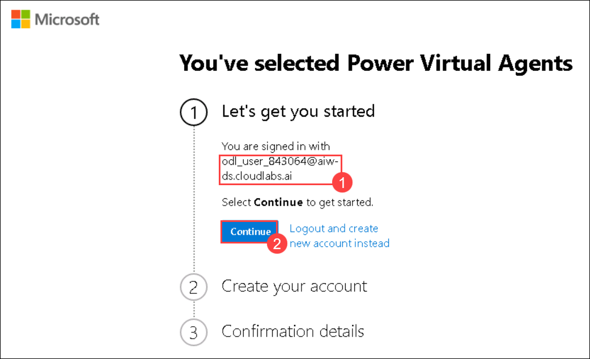

3. Once **Signed in**, under Create your account, **choose your respective region (1)** from the drop-down menu and click on **Get Started (2)**.
   
   
   
4. Under the **Confirmation details (1)**, click on **Get Started (2)**.

    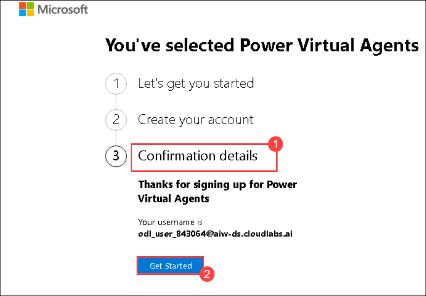

5. You have now successfully signed up for **Power Virtual Agents**.

6. On the **Welcome to Power Virtual Agents (1)** page, choose your respective region and select **Get Started (2)**.

   

7. On the **Create a Chatbot** page enter the following details:

   - **Name of your bot (1)**: Enter **AI-Bot-<inject key="DeploymentID" enableCopy="false"/>**.
   - **What language will your bot speak? (2)**: Select **English (US)** from the dropdown.

   Now select **Create (3)**.

   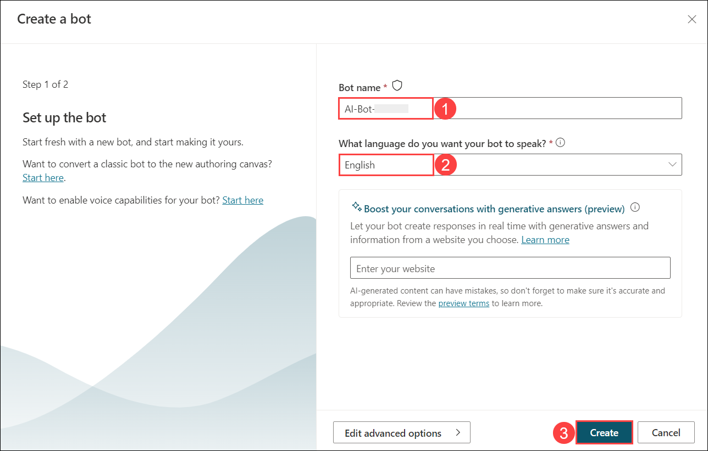

8. Once the Bot is created you will see the Power virtual agents page.

   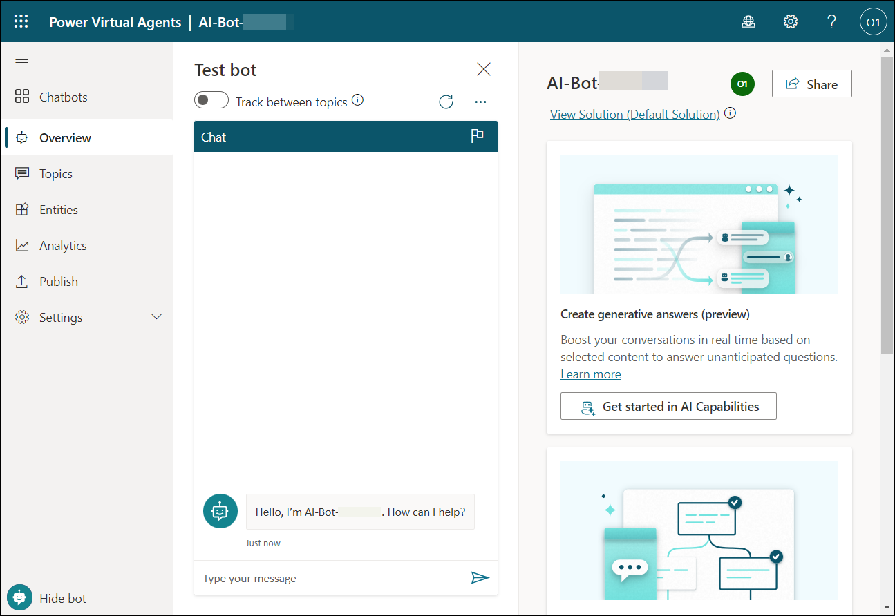

## Task 4 - Create a new Topic

1. One the **Power Virtual Agents** page, select **Topics** **(1)**, **New Topic** **(2)** and select **Create with Copilot** **(3)**.

   

2. In Create it with Copilot pane, Name your topic as **Meal delivery options** **(1)**. In Create a topic to ..., enter the given phrase "**Checking for food options based on the city you are in**" **(2)**, then click on **Create** **(3)**.

   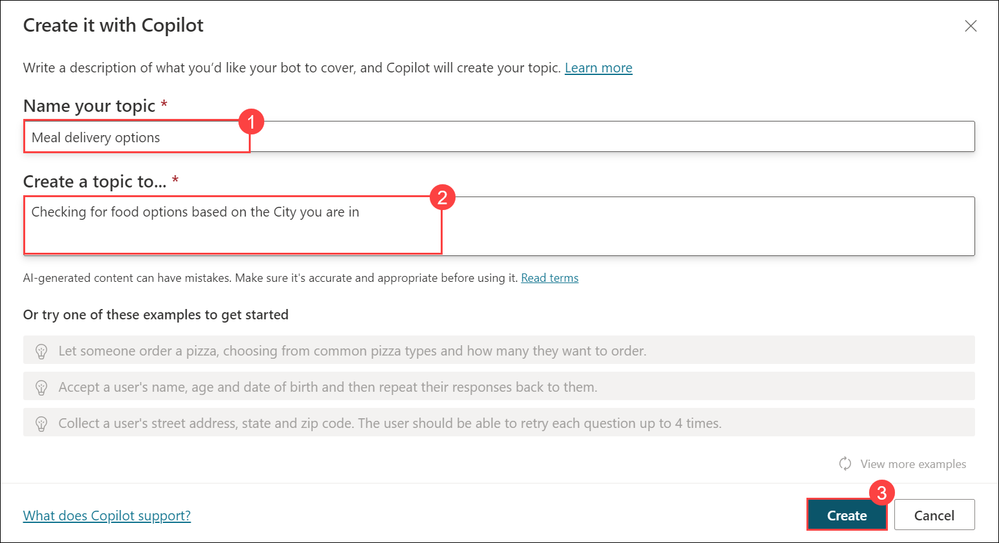

3. Once you are in the topic pane, **close** **(1)** the edit with copilot pane from right-side. Scroll-down to the **Message** node, click on **eclipse** button **(2)** and select **Delete** **(3)** to remove the message node.

   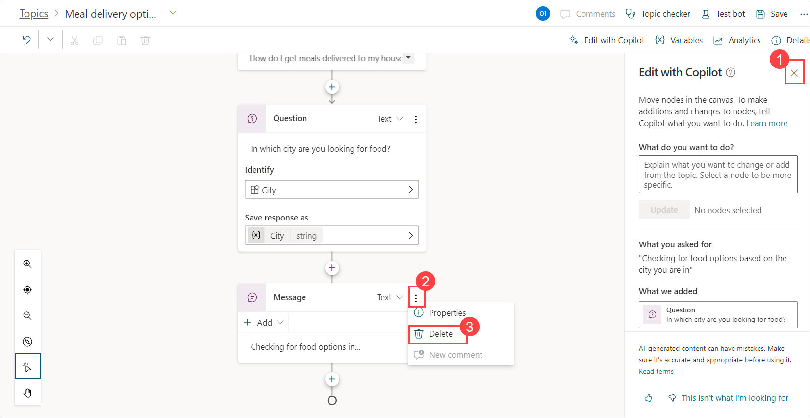

4. On the **topic** pane, click on **+** at the bottom to **Add node**.

   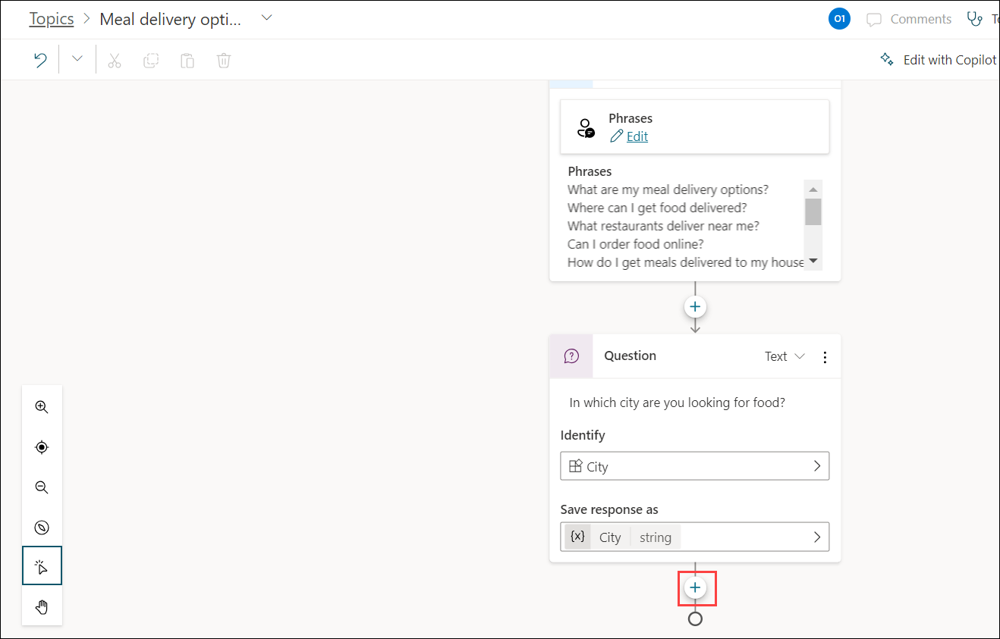

5. Select **Ask a question** from drop-down while adding a node.

   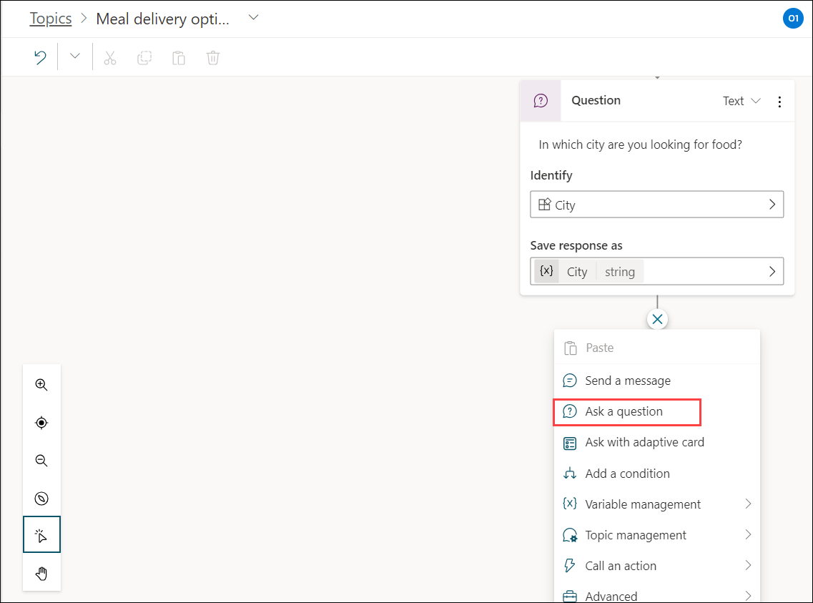

6. Enter the question as "**What type of food would you like to order?**" **(1)** and under options for users, click on **New option** **(2)** to add types of food. Add **Chinese** and **Italian** **(3)** as shown in the below screenshot.

    
   
7. Now under Condition of Chinese, click on **+** to Add node.

   

8. Select **Send a message** from drop-down while adding a node.

   

9. Enter the Chinese food items given here in message section: **Noodles, Spring Rolls, Fried Chicken**

   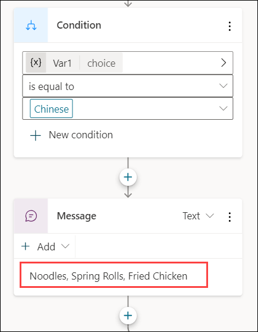

10. Now under Condition of Italian, click on **+** to Add node.

    

11. Select **Send a message** from drop-down while adding a node.

    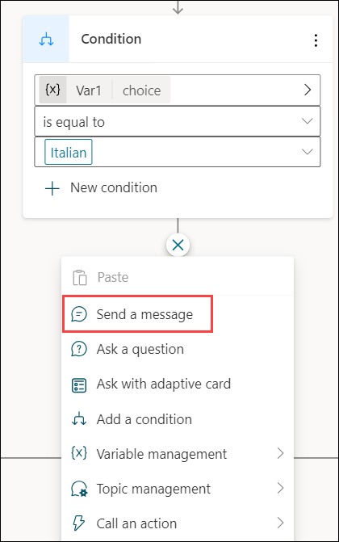

12. Enter the Italian food items given here in message section: **Pizza, Pasta, Truffles**

    

13. Review the topic trigger, click on **Save** to save the topic.

    

## Task 5 - Test your Bot

1. Once the Topic is saved, click on **Test bot**.

   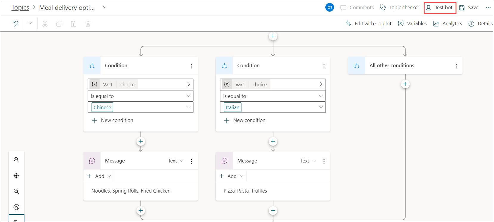

2. In the Test bot pane, enable the **Track between topics**.

   

3. Enter the below phrase in a trigger phrase in Test bot. 

   ```what meals can I order```

   

4. Then enter the name of the city as **Seattle**. Your chatbot should display images of the meals in an adaptive card as show below.

   

Now you have successfully created and tested Power Virtual Agents bot
